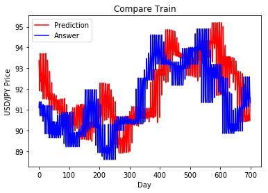
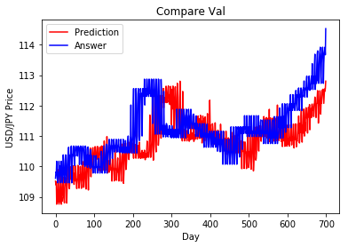
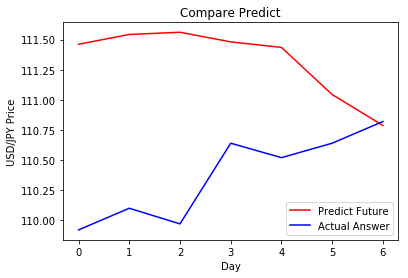

# . Kit Import


```python
import pandas as pd
import numpy as np
from keras.models import Sequential
from keras.layers import Dense, Dropout, Activation, Flatten, LSTM, TimeDistributed, RepeatVector
from keras.layers.normalization import BatchNormalization
from keras.optimizers import Adam
from keras.callbacks import EarlyStopping, ModelCheckpoint
from keras.losses import binary_crossentropy
from sklearn import preprocessing
import matplotlib.pyplot as plt
%matplotlib inline

import warnings
warnings.filterwarnings('ignore')
```

    D:\Program\Anaconda3\envs\tensorflow\lib\site-packages\h5py\__init__.py:34: FutureWarning: Conversion of the second argument of issubdtype from `float` to `np.floating` is deprecated. In future, it will be treated as `np.float64 == np.dtype(float).type`.
      from ._conv import register_converters as _register_converters
    Using TensorFlow backend.
    

# . Method definition block


```python
def readTrain(data):  # 讀取訓練資料
    train = pd.read_csv(data)
    train["Date"] = pd.to_datetime(train["Date"])
    train = train.sort_values(by="Date")
    train = train.reset_index(drop=True)
    return train

def augFeatures(train):   # 特徵擴展
#     train["year"] = train["Date"].dt.year
#     train["month"] = train["Date"].dt.month
    train["date"] = train["Date"].dt.day
    train["day"] = train["Date"].dt.dayofweek
    train["Change %"] = train["Change %"].apply(lambda x: float(x.replace("%","")))
    train["Label"] = train["Change %"].apply(lambda x: x>0 )
    train.rename(columns={'Price': 'Close'}, inplace=True)
    train = train.drop(["Date"], axis=1)
    
    ewma = pd.Series.ewm # 指數加權函數
    train['ewma_26'] =  train['Close'].transform(lambda x : ewma(x, span=26,ignore_na=False).mean())
    train['ewma_26'] = train['ewma_26'].fillna(0)  
    return train

def normalize(train):  # 資料歸一化 (使數值介於0~1之間)
    newdf= train.copy()
    min_max_scaler = preprocessing.MinMaxScaler()
    for col in train.columns:
         newdf[col] = min_max_scaler.fit_transform(train[col].values.reshape(-1,1)) 
    return newdf

def buildTrain(train, pastDay, futureDay,method,pred=False): # 訓練資料建立
    X_train, Y_train = [], []
    for i in range(train.shape[0]-futureDay-pastDay):
        X_train.append(np.array(train.iloc[i:i+pastDay]))
        if method == "Label":
            Y_train.append(np.array(train.iloc[i+pastDay:i+pastDay+futureDay]["Label"]))
        elif method == "reg":
            Y_train.append(np.array(train.iloc[i+pastDay:i+pastDay+futureDay]["Close"]))
    if not pred:
        return np.array(X_train), np.array(Y_train)
    else:
        return np.array(X_train)

def shuffle(X,Y): # 亂序
    np.random.seed(10)
    randomList = np.arange(X.shape[0])
    np.random.shuffle(randomList)
    return X[randomList], Y[randomList]

def splitData(X,Y,rate):  # 資料分割
    X_train = X[:int(X.shape[0]*rate)]
    Y_train = Y[:int(Y.shape[0]*rate)]
    X_val = X[int(X.shape[0]*(rate)):]
    Y_val = Y[int(Y.shape[0]*(rate)):]
    return X_train, Y_train, X_val, Y_val

def buildManyToManyModel(shape):  # 建立序列對序列模型 (7 - 7)
    model = Sequential()
    model.add(LSTM(10, input_shape=(shape[1], shape[2]), return_sequences=True)) # input_length=shape[1], input_dim=shape[2]
    model.add(Dropout(0.2))

    model.add(TimeDistributed(Dense(1)))
    model.compile(loss="mse", optimizer="adam")    
    model.summary()
    return model

# def buildManyToManyModel(shape):
#     model = Sequential()
#     model.add(LSTM(units = 50, return_sequences = True, input_shape=(shape[1], shape[2])))
#     model.add(Dropout(0.2))
    
#     model.add(LSTM(units = 50, return_sequences = True, input_shape=(shape[1], shape[2])))
#     model.add(Dropout(0.2))
    
#     model.add(LSTM(units = 50, return_sequences = True, input_shape=(shape[1], shape[2])))
#     model.add(Dropout(0.2))
    
#     model.add(Dense(16,kernel_initializer="uniform",activation='relu'))
#     model.add(Dense(units = 1))
    
#     model.compile(loss="mae", optimizer="adam")    
#     model.summary()
#     return model

# def buildManyToManyModel(shape):
#     d = 0.3
#     model = Sequential()
#     model.add(LSTM(256, input_shape=(shape[1], shape[2]), return_sequences=True))
#     model.add(Dropout(d))
    
#     model.add(LSTM(256, input_shape=(shape[1], shape[2]), return_sequences=False))
#     model.add(Dropout(d))

#     model.add(Dense(16,kernel_initializer="uniform",activation='relu'))
#     model.add(Dense(1,kernel_initializer="uniform",activation='linear'))

#     model.compile(loss='mse',optimizer='adam', metrics=['accuracy'])
#     model.summary()

#     return model
```

# . Model establishment


```python
train = readTrain("USD_JPY Historical Data.csv")
train_Aug = augFeatures(train)
train_Aug.head()
```


<div>
<style>
    .dataframe thead tr:only-child th {
        text-align: right;
    }

    .dataframe thead th {
        text-align: left;
    }

    .dataframe tbody tr th {
        vertical-align: top;
    }
</style>
<table border="1" class="dataframe">
  <thead>
    <tr style="text-align: right;">
      <th></th>
      <th>Close</th>
      <th>Open</th>
      <th>High</th>
      <th>Low</th>
      <th>Change %</th>
      <th>date</th>
      <th>day</th>
      <th>Label</th>
      <th>ewma_26</th>
    </tr>
  </thead>
  <tbody>
    <tr>
      <th>0</th>
      <td>93.04</td>
      <td>93.04</td>
      <td>93.04</td>
      <td>93.04</td>
      <td>0.01</td>
      <td>1</td>
      <td>4</td>
      <td>True</td>
      <td>93.040000</td>
    </tr>
    <tr>
      <th>1</th>
      <td>92.47</td>
      <td>92.75</td>
      <td>93.21</td>
      <td>92.19</td>
      <td>-0.60</td>
      <td>4</td>
      <td>0</td>
      <td>False</td>
      <td>92.744038</td>
    </tr>
    <tr>
      <th>2</th>
      <td>91.58</td>
      <td>92.47</td>
      <td>92.51</td>
      <td>91.25</td>
      <td>-0.97</td>
      <td>5</td>
      <td>1</td>
      <td>False</td>
      <td>92.325811</td>
    </tr>
    <tr>
      <th>3</th>
      <td>92.38</td>
      <td>91.56</td>
      <td>92.74</td>
      <td>91.53</td>
      <td>0.87</td>
      <td>6</td>
      <td>2</td>
      <td>True</td>
      <td>92.340960</td>
    </tr>
    <tr>
      <th>4</th>
      <td>93.45</td>
      <td>92.36</td>
      <td>93.77</td>
      <td>92.11</td>
      <td>1.16</td>
      <td>7</td>
      <td>3</td>
      <td>True</td>
      <td>92.598151</td>
    </tr>
  </tbody>
</table>
</div>


```python

train_norm = normalize(train_Aug)

# # build Data, use last 30 days to predict next 5 days
X_train, Y_train = buildTrain(train_norm,7,7,method="reg")
X_train, Y_train, X_val, Y_val = splitData(X_train, Y_train, 0.9) # regression / Classification

print("X_trian: %s\nY_train: %s\nX_val: %s\nY_val: %s"%(X_train.shape,Y_train.shape,X_val.shape,Y_val.shape))
# # from 2 dimmension to 3 dimension
Y_train = Y_train[:,:,np.newaxis]
Y_val = Y_val[:,:,np.newaxis]
# model = buildOneToOneModel(X_train.shape)
model = buildManyToManyModel(X_train.shape)
```

    X_trian: (2189, 7, 9)
    Y_train: (2189, 7)
    X_val: (244, 7, 9)
    Y_val: (244, 7)
    _________________________________________________________________
    Layer (type)                 Output Shape              Param #   
    =================================================================
    lstm_1 (LSTM)                (None, 7, 10)             800       
    _________________________________________________________________
    dropout_1 (Dropout)          (None, 7, 10)             0         
    _________________________________________________________________
    time_distributed_1 (TimeDist (None, 7, 1)              11        
    =================================================================
    Total params: 811
    Trainable params: 811
    Non-trainable params: 0
    _________________________________________________________________
    

# . Model training


```python
callback = EarlyStopping(monitor="loss", patience=30, verbose=1, mode="auto")
model.fit(X_train, Y_train, epochs=1000, batch_size=128, validation_data=(X_val, Y_val), callbacks=[callback])
```

    Train on 2189 samples, validate on 244 samples
    Epoch 1/1000
    2189/2189 [==============================] - 1s 324us/step - loss: 0.0497 - val_loss: 0.0324
    Epoch 2/1000
    2189/2189 [==============================] - 0s 40us/step - loss: 0.0387 - val_loss: 0.0251
    Epoch 3/1000
    2189/2189 [==============================] - 0s 39us/step - loss: 0.0317 - val_loss: 0.0181
    Epoch 4/1000
    2189/2189 [==============================] - 0s 39us/step - loss: 0.0256 - val_loss: 0.0130
    Epoch 5/1000
    2189/2189 [==============================] - 0s 44us/step - loss: 0.0211 - val_loss: 0.0098
    Epoch 6/1000
    2189/2189 [==============================] - 0s 41us/step - loss: 0.0180 - val_loss: 0.0075
    Epoch 7/1000
    2189/2189 [==============================] - 0s 40us/step - loss: 0.0153 - val_loss: 0.0059
    Epoch 8/1000
    2189/2189 [==============================] - 0s 38us/step - loss: 0.0137 - val_loss: 0.0045
    Epoch 9/1000
    2189/2189 [==============================] - 0s 42us/step - loss: 0.0123 - val_loss: 0.0036
    Epoch 10/1000
    2189/2189 [==============================] - 0s 42us/step - loss: 0.0114 - val_loss: 0.0028
    Epoch 11/1000
    2189/2189 [==============================] - 0s 41us/step - loss: 0.0101 - val_loss: 0.0022
    Epoch 12/1000
    2189/2189 [==============================] - 0s 41us/step - loss: 0.0096 - val_loss: 0.0018
    Epoch 13/1000
    2189/2189 [==============================] - 0s 38us/step - loss: 0.0085 - val_loss: 0.0015
    Epoch 14/1000
    2189/2189 [==============================] - 0s 41us/step - loss: 0.0083 - val_loss: 0.0013
    Epoch 15/1000
    2189/2189 [==============================] - 0s 42us/step - loss: 0.0081 - val_loss: 0.0011
    Epoch 16/1000
    2189/2189 [==============================] - 0s 44us/step - loss: 0.0078 - val_loss: 8.9897e-04
    Epoch 17/1000
    2189/2189 [==============================] - 0s 40us/step - loss: 0.0071 - val_loss: 7.5169e-04
    Epoch 18/1000
    2189/2189 [==============================] - 0s 40us/step - loss: 0.0071 - val_loss: 8.5077e-04
    Epoch 19/1000
    2189/2189 [==============================] - 0s 45us/step - loss: 0.0070 - val_loss: 9.1713e-04
    Epoch 20/1000
    2189/2189 [==============================] - 0s 43us/step - loss: 0.0069 - val_loss: 0.0010
    Epoch 21/1000
    2189/2189 [==============================] - 0s 41us/step - loss: 0.0067 - val_loss: 7.7388e-04
    Epoch 22/1000
    2189/2189 [==============================] - 0s 41us/step - loss: 0.0065 - val_loss: 8.3707e-04
    Epoch 23/1000
    2189/2189 [==============================] - 0s 42us/step - loss: 0.0064 - val_loss: 7.0864e-04
    Epoch 24/1000
    2189/2189 [==============================] - 0s 43us/step - loss: 0.0061 - val_loss: 6.9173e-04
    Epoch 25/1000
    2189/2189 [==============================] - 0s 42us/step - loss: 0.0061 - val_loss: 8.3444e-04
    Epoch 26/1000
    2189/2189 [==============================] - 0s 38us/step - loss: 0.0061 - val_loss: 9.0196e-04
    Epoch 27/1000
    2189/2189 [==============================] - 0s 41us/step - loss: 0.0059 - val_loss: 0.0010
    Epoch 28/1000
    2189/2189 [==============================] - 0s 40us/step - loss: 0.0058 - val_loss: 7.6636e-04
    Epoch 29/1000
    2189/2189 [==============================] - 0s 40us/step - loss: 0.0057 - val_loss: 7.8687e-04
    Epoch 30/1000
    2189/2189 [==============================] - 0s 42us/step - loss: 0.0057 - val_loss: 7.3874e-04
    Epoch 31/1000
    2189/2189 [==============================] - 0s 43us/step - loss: 0.0055 - val_loss: 7.5972e-04
    Epoch 32/1000
    2189/2189 [==============================] - 0s 40us/step - loss: 0.0055 - val_loss: 7.5477e-04
    Epoch 33/1000
    2189/2189 [==============================] - 0s 42us/step - loss: 0.0054 - val_loss: 6.1866e-04
    Epoch 34/1000
    2189/2189 [==============================] - 0s 44us/step - loss: 0.0053 - val_loss: 5.6152e-04
    Epoch 35/1000
    2189/2189 [==============================] - 0s 42us/step - loss: 0.0053 - val_loss: 6.1327e-04
    Epoch 36/1000
    2189/2189 [==============================] - 0s 40us/step - loss: 0.0052 - val_loss: 5.0721e-04
    Epoch 37/1000
    2189/2189 [==============================] - 0s 40us/step - loss: 0.0052 - val_loss: 5.9227e-04
    Epoch 38/1000
    2189/2189 [==============================] - 0s 43us/step - loss: 0.0049 - val_loss: 7.3329e-04
    Epoch 39/1000
    2189/2189 [==============================] - 0s 42us/step - loss: 0.0049 - val_loss: 6.8867e-04
    Epoch 40/1000
    2189/2189 [==============================] - 0s 41us/step - loss: 0.0048 - val_loss: 5.0362e-04
    Epoch 41/1000
    2189/2189 [==============================] - 0s 42us/step - loss: 0.0049 - val_loss: 5.3931e-04
    Epoch 42/1000
    2189/2189 [==============================] - 0s 42us/step - loss: 0.0048 - val_loss: 5.2600e-04
    Epoch 43/1000
    2189/2189 [==============================] - 0s 41us/step - loss: 0.0048 - val_loss: 5.7489e-04
    Epoch 44/1000
    2189/2189 [==============================] - 0s 42us/step - loss: 0.0046 - val_loss: 5.1322e-04
    Epoch 45/1000
    2189/2189 [==============================] - 0s 46us/step - loss: 0.0047 - val_loss: 8.2993e-04
    Epoch 46/1000
    2189/2189 [==============================] - 0s 42us/step - loss: 0.0046 - val_loss: 6.2612e-04
    Epoch 47/1000
    2189/2189 [==============================] - 0s 40us/step - loss: 0.0045 - val_loss: 5.1630e-04
    Epoch 48/1000
    2189/2189 [==============================] - 0s 42us/step - loss: 0.0045 - val_loss: 5.9495e-04
    Epoch 49/1000
    2189/2189 [==============================] - 0s 41us/step - loss: 0.0044 - val_loss: 5.6767e-04
    Epoch 50/1000
    2189/2189 [==============================] - 0s 41us/step - loss: 0.0043 - val_loss: 4.8732e-04
    Epoch 51/1000
    2189/2189 [==============================] - 0s 41us/step - loss: 0.0043 - val_loss: 5.4548e-04
    Epoch 52/1000
    2189/2189 [==============================] - 0s 40us/step - loss: 0.0044 - val_loss: 5.3778e-04
    Epoch 53/1000
    2189/2189 [==============================] - 0s 42us/step - loss: 0.0044 - val_loss: 7.0627e-04
    Epoch 54/1000
    2189/2189 [==============================] - 0s 38us/step - loss: 0.0041 - val_loss: 5.4638e-04
    Epoch 55/1000
    2189/2189 [==============================] - 0s 41us/step - loss: 0.0042 - val_loss: 6.7051e-04
    Epoch 56/1000
    2189/2189 [==============================] - 0s 41us/step - loss: 0.0040 - val_loss: 6.3992e-04
    Epoch 57/1000
    2189/2189 [==============================] - 0s 38us/step - loss: 0.0041 - val_loss: 5.3234e-04
    Epoch 58/1000
    2189/2189 [==============================] - 0s 38us/step - loss: 0.0042 - val_loss: 6.0104e-04
    Epoch 59/1000
    2189/2189 [==============================] - 0s 38us/step - loss: 0.0040 - val_loss: 6.2790e-04
    Epoch 60/1000
    2189/2189 [==============================] - 0s 39us/step - loss: 0.0041 - val_loss: 4.9767e-04
    Epoch 61/1000
    2189/2189 [==============================] - 0s 38us/step - loss: 0.0040 - val_loss: 7.2149e-04
    Epoch 62/1000
    2189/2189 [==============================] - 0s 38us/step - loss: 0.0041 - val_loss: 4.9991e-04
    Epoch 63/1000
    2189/2189 [==============================] - 0s 37us/step - loss: 0.0039 - val_loss: 4.9384e-04
    Epoch 64/1000
    2189/2189 [==============================] - 0s 38us/step - loss: 0.0040 - val_loss: 5.1921e-04
    Epoch 65/1000
    2189/2189 [==============================] - 0s 38us/step - loss: 0.0040 - val_loss: 5.8909e-04
    Epoch 66/1000
    2189/2189 [==============================] - 0s 38us/step - loss: 0.0039 - val_loss: 4.3757e-04
    Epoch 67/1000
    2189/2189 [==============================] - 0s 37us/step - loss: 0.0039 - val_loss: 4.7648e-04
    Epoch 68/1000
    2189/2189 [==============================] - 0s 38us/step - loss: 0.0038 - val_loss: 4.4359e-04
    Epoch 69/1000
    2189/2189 [==============================] - 0s 37us/step - loss: 0.0038 - val_loss: 4.6495e-04
    Epoch 70/1000
    2189/2189 [==============================] - 0s 37us/step - loss: 0.0038 - val_loss: 4.8692e-04
    Epoch 71/1000
    2189/2189 [==============================] - 0s 39us/step - loss: 0.0037 - val_loss: 4.9734e-04
    Epoch 72/1000
    2189/2189 [==============================] - 0s 38us/step - loss: 0.0038 - val_loss: 6.0113e-04
    Epoch 73/1000
    2189/2189 [==============================] - 0s 39us/step - loss: 0.0038 - val_loss: 4.6223e-04
    Epoch 74/1000
    2189/2189 [==============================] - 0s 37us/step - loss: 0.0037 - val_loss: 5.1951e-04
    Epoch 75/1000
    2189/2189 [==============================] - 0s 38us/step - loss: 0.0037 - val_loss: 4.9762e-04
    Epoch 76/1000
    2189/2189 [==============================] - 0s 40us/step - loss: 0.0037 - val_loss: 5.8666e-04
    Epoch 77/1000
    2189/2189 [==============================] - 0s 37us/step - loss: 0.0037 - val_loss: 5.3888e-04
    Epoch 78/1000
    2189/2189 [==============================] - 0s 38us/step - loss: 0.0037 - val_loss: 4.3382e-04
    Epoch 79/1000
    2189/2189 [==============================] - 0s 37us/step - loss: 0.0037 - val_loss: 4.9817e-04
    Epoch 80/1000
    2189/2189 [==============================] - 0s 38us/step - loss: 0.0037 - val_loss: 5.1294e-04
    Epoch 81/1000
    2189/2189 [==============================] - 0s 43us/step - loss: 0.0037 - val_loss: 4.7794e-04
    Epoch 82/1000
    2189/2189 [==============================] - 0s 40us/step - loss: 0.0036 - val_loss: 5.0264e-04
    Epoch 83/1000
    2189/2189 [==============================] - 0s 42us/step - loss: 0.0035 - val_loss: 4.9836e-04
    Epoch 84/1000
    2189/2189 [==============================] - 0s 40us/step - loss: 0.0036 - val_loss: 5.3917e-04
    Epoch 85/1000
    2189/2189 [==============================] - 0s 40us/step - loss: 0.0036 - val_loss: 4.2243e-04
    Epoch 86/1000
    2189/2189 [==============================] - 0s 40us/step - loss: 0.0036 - val_loss: 4.4742e-04
    Epoch 87/1000
    2189/2189 [==============================] - 0s 41us/step - loss: 0.0035 - val_loss: 4.9173e-04
    Epoch 88/1000
    2189/2189 [==============================] - 0s 45us/step - loss: 0.0036 - val_loss: 5.7049e-04
    Epoch 89/1000
    2189/2189 [==============================] - 0s 41us/step - loss: 0.0035 - val_loss: 4.6694e-04
    Epoch 90/1000
    2189/2189 [==============================] - 0s 39us/step - loss: 0.0035 - val_loss: 4.3001e-04
    Epoch 91/1000
    2189/2189 [==============================] - 0s 40us/step - loss: 0.0035 - val_loss: 4.5813e-04
    Epoch 92/1000
    2189/2189 [==============================] - 0s 40us/step - loss: 0.0035 - val_loss: 5.3005e-04
    Epoch 93/1000
    2189/2189 [==============================] - 0s 40us/step - loss: 0.0035 - val_loss: 4.3040e-04
    Epoch 94/1000
    2189/2189 [==============================] - 0s 44us/step - loss: 0.0035 - val_loss: 5.2659e-04
    Epoch 95/1000
    2189/2189 [==============================] - ETA: 0s - loss: 0.003 - 0s 46us/step - loss: 0.0035 - val_loss: 4.0754e-04
    Epoch 96/1000
    2189/2189 [==============================] - 0s 47us/step - loss: 0.0036 - val_loss: 4.8048e-04
    Epoch 97/1000
    2189/2189 [==============================] - 0s 44us/step - loss: 0.0035 - val_loss: 4.2379e-04
    Epoch 98/1000
    2189/2189 [==============================] - 0s 44us/step - loss: 0.0035 - val_loss: 4.8464e-04
    Epoch 99/1000
    2189/2189 [==============================] - 0s 41us/step - loss: 0.0035 - val_loss: 5.5294e-04
    Epoch 100/1000
    2189/2189 [==============================] - 0s 39us/step - loss: 0.0034 - val_loss: 4.7514e-04
    Epoch 101/1000
    2189/2189 [==============================] - 0s 42us/step - loss: 0.0034 - val_loss: 5.4799e-04
    Epoch 102/1000
    2189/2189 [==============================] - 0s 39us/step - loss: 0.0034 - val_loss: 4.0564e-04
    Epoch 103/1000
    2189/2189 [==============================] - 0s 39us/step - loss: 0.0035 - val_loss: 4.1689e-04
    Epoch 104/1000
    2189/2189 [==============================] - 0s 38us/step - loss: 0.0035 - val_loss: 6.1426e-04
    Epoch 105/1000
    2189/2189 [==============================] - 0s 39us/step - loss: 0.0034 - val_loss: 5.0220e-04
    Epoch 106/1000
    2189/2189 [==============================] - 0s 38us/step - loss: 0.0034 - val_loss: 4.1856e-04
    Epoch 107/1000
    2189/2189 [==============================] - 0s 37us/step - loss: 0.0034 - val_loss: 5.9068e-04
    Epoch 108/1000
    2189/2189 [==============================] - 0s 38us/step - loss: 0.0034 - val_loss: 4.5927e-04
    Epoch 109/1000
    2189/2189 [==============================] - 0s 38us/step - loss: 0.0034 - val_loss: 4.7663e-04
    Epoch 110/1000
    2189/2189 [==============================] - 0s 38us/step - loss: 0.0033 - val_loss: 4.4425e-04
    Epoch 111/1000
    2189/2189 [==============================] - 0s 37us/step - loss: 0.0034 - val_loss: 5.3052e-04
    Epoch 112/1000
    2189/2189 [==============================] - 0s 38us/step - loss: 0.0033 - val_loss: 4.6640e-04
    Epoch 113/1000
    2189/2189 [==============================] - 0s 38us/step - loss: 0.0033 - val_loss: 4.0439e-04
    Epoch 114/1000
    2189/2189 [==============================] - 0s 37us/step - loss: 0.0035 - val_loss: 3.9574e-04
    Epoch 115/1000
    2189/2189 [==============================] - 0s 37us/step - loss: 0.0034 - val_loss: 4.4308e-04
    Epoch 116/1000
    2189/2189 [==============================] - 0s 37us/step - loss: 0.0033 - val_loss: 4.6331e-04
    Epoch 117/1000
    2189/2189 [==============================] - 0s 38us/step - loss: 0.0033 - val_loss: 3.9376e-04
    Epoch 118/1000
    2189/2189 [==============================] - 0s 37us/step - loss: 0.0034 - val_loss: 4.3080e-04
    Epoch 119/1000
    2189/2189 [==============================] - 0s 38us/step - loss: 0.0034 - val_loss: 4.0319e-04
    Epoch 120/1000
    2189/2189 [==============================] - 0s 38us/step - loss: 0.0033 - val_loss: 4.7616e-04
    Epoch 121/1000
    2189/2189 [==============================] - 0s 37us/step - loss: 0.0033 - val_loss: 4.4573e-04
    Epoch 122/1000
    2189/2189 [==============================] - 0s 38us/step - loss: 0.0032 - val_loss: 4.7036e-04
    Epoch 123/1000
    2189/2189 [==============================] - 0s 37us/step - loss: 0.0033 - val_loss: 4.3455e-04
    Epoch 124/1000
    2189/2189 [==============================] - 0s 38us/step - loss: 0.0032 - val_loss: 4.6045e-04
    Epoch 125/1000
    2189/2189 [==============================] - 0s 38us/step - loss: 0.0032 - val_loss: 4.7735e-04
    Epoch 126/1000
    2189/2189 [==============================] - 0s 37us/step - loss: 0.0032 - val_loss: 3.9654e-04
    Epoch 127/1000
    2189/2189 [==============================] - 0s 37us/step - loss: 0.0033 - val_loss: 4.2908e-04
    Epoch 128/1000
    2189/2189 [==============================] - 0s 38us/step - loss: 0.0033 - val_loss: 3.9056e-04
    Epoch 129/1000
    2189/2189 [==============================] - 0s 38us/step - loss: 0.0033 - val_loss: 4.6317e-04
    Epoch 130/1000
    2189/2189 [==============================] - 0s 37us/step - loss: 0.0032 - val_loss: 3.8878e-04
    Epoch 131/1000
    2189/2189 [==============================] - 0s 37us/step - loss: 0.0033 - val_loss: 4.0693e-04
    Epoch 132/1000
    2189/2189 [==============================] - 0s 38us/step - loss: 0.0033 - val_loss: 3.8934e-04
    Epoch 133/1000
    2189/2189 [==============================] - 0s 38us/step - loss: 0.0033 - val_loss: 3.8269e-04
    Epoch 134/1000
    2189/2189 [==============================] - 0s 37us/step - loss: 0.0033 - val_loss: 4.6805e-04
    Epoch 135/1000
    2189/2189 [==============================] - 0s 38us/step - loss: 0.0032 - val_loss: 6.1326e-04
    Epoch 136/1000
    2189/2189 [==============================] - 0s 37us/step - loss: 0.0033 - val_loss: 4.0552e-04
    Epoch 137/1000
    2189/2189 [==============================] - 0s 37us/step - loss: 0.0032 - val_loss: 5.3049e-04
    Epoch 138/1000
    2189/2189 [==============================] - 0s 38us/step - loss: 0.0033 - val_loss: 4.9386e-04
    Epoch 139/1000
    2189/2189 [==============================] - 0s 37us/step - loss: 0.0033 - val_loss: 4.6978e-04
    Epoch 140/1000
    2189/2189 [==============================] - 0s 38us/step - loss: 0.0032 - val_loss: 4.9739e-04
    Epoch 141/1000
    2189/2189 [==============================] - 0s 38us/step - loss: 0.0033 - val_loss: 4.2169e-04
    Epoch 142/1000
    2189/2189 [==============================] - 0s 39us/step - loss: 0.0033 - val_loss: 4.1863e-04
    Epoch 143/1000
    2189/2189 [==============================] - 0s 37us/step - loss: 0.0032 - val_loss: 3.9426e-04
    Epoch 144/1000
    2189/2189 [==============================] - 0s 38us/step - loss: 0.0032 - val_loss: 3.9998e-04
    Epoch 145/1000
    2189/2189 [==============================] - 0s 39us/step - loss: 0.0033 - val_loss: 4.6426e-04
    Epoch 146/1000
    2189/2189 [==============================] - 0s 39us/step - loss: 0.0032 - val_loss: 4.5976e-04
    Epoch 147/1000
    2189/2189 [==============================] - 0s 37us/step - loss: 0.0032 - val_loss: 3.9238e-04
    Epoch 148/1000
    2189/2189 [==============================] - 0s 37us/step - loss: 0.0033 - val_loss: 4.5388e-04
    Epoch 149/1000
    2189/2189 [==============================] - 0s 38us/step - loss: 0.0032 - val_loss: 3.7825e-04
    Epoch 150/1000
    2189/2189 [==============================] - 0s 37us/step - loss: 0.0033 - val_loss: 4.1385e-04
    Epoch 151/1000
    2189/2189 [==============================] - 0s 37us/step - loss: 0.0033 - val_loss: 4.3408e-04
    Epoch 152/1000
    2189/2189 [==============================] - 0s 39us/step - loss: 0.0032 - val_loss: 4.2486e-04
    Epoch 153/1000
    2189/2189 [==============================] - 0s 38us/step - loss: 0.0032 - val_loss: 3.7692e-04
    Epoch 154/1000
    2189/2189 [==============================] - 0s 38us/step - loss: 0.0032 - val_loss: 4.6937e-04
    Epoch 155/1000
    2189/2189 [==============================] - 0s 37us/step - loss: 0.0032 - val_loss: 4.2861e-04
    Epoch 156/1000
    2189/2189 [==============================] - 0s 37us/step - loss: 0.0032 - val_loss: 3.7682e-04
    Epoch 157/1000
    2189/2189 [==============================] - 0s 38us/step - loss: 0.0031 - val_loss: 3.7701e-04
    Epoch 158/1000
    2189/2189 [==============================] - 0s 38us/step - loss: 0.0032 - val_loss: 3.8683e-04
    Epoch 159/1000
    2189/2189 [==============================] - 0s 37us/step - loss: 0.0032 - val_loss: 3.8738e-04
    Epoch 160/1000
    2189/2189 [==============================] - 0s 37us/step - loss: 0.0032 - val_loss: 3.8875e-04
    Epoch 161/1000
    2189/2189 [==============================] - 0s 37us/step - loss: 0.0033 - val_loss: 3.7823e-04
    Epoch 162/1000
    2189/2189 [==============================] - 0s 37us/step - loss: 0.0032 - val_loss: 3.7192e-04
    Epoch 163/1000
    2189/2189 [==============================] - 0s 39us/step - loss: 0.0032 - val_loss: 5.1546e-04
    Epoch 164/1000
    2189/2189 [==============================] - 0s 39us/step - loss: 0.0032 - val_loss: 4.3224e-04
    Epoch 165/1000
    2189/2189 [==============================] - 0s 39us/step - loss: 0.0032 - val_loss: 3.9117e-04
    Epoch 166/1000
    2189/2189 [==============================] - 0s 38us/step - loss: 0.0032 - val_loss: 4.0239e-04
    Epoch 167/1000
    2189/2189 [==============================] - 0s 38us/step - loss: 0.0033 - val_loss: 3.7811e-04
    Epoch 168/1000
    2189/2189 [==============================] - 0s 39us/step - loss: 0.0033 - val_loss: 4.1272e-04
    Epoch 169/1000
    2189/2189 [==============================] - 0s 40us/step - loss: 0.0032 - val_loss: 4.1192e-04
    Epoch 170/1000
    2189/2189 [==============================] - 0s 39us/step - loss: 0.0032 - val_loss: 3.7870e-04
    Epoch 171/1000
    2189/2189 [==============================] - 0s 37us/step - loss: 0.0032 - val_loss: 4.0210e-04
    Epoch 172/1000
    2189/2189 [==============================] - 0s 41us/step - loss: 0.0032 - val_loss: 8.1401e-04
    Epoch 173/1000
    2189/2189 [==============================] - 0s 43us/step - loss: 0.0032 - val_loss: 3.7928e-04
    Epoch 174/1000
    2189/2189 [==============================] - 0s 40us/step - loss: 0.0032 - val_loss: 4.0867e-04
    Epoch 175/1000
    2189/2189 [==============================] - 0s 38us/step - loss: 0.0032 - val_loss: 5.1468e-04
    Epoch 176/1000
    2189/2189 [==============================] - 0s 41us/step - loss: 0.0032 - val_loss: 4.1522e-04
    Epoch 177/1000
    2189/2189 [==============================] - 0s 42us/step - loss: 0.0032 - val_loss: 3.7378e-04
    Epoch 178/1000
    2189/2189 [==============================] - 0s 41us/step - loss: 0.0032 - val_loss: 4.2681e-04
    Epoch 179/1000
    2189/2189 [==============================] - 0s 37us/step - loss: 0.0032 - val_loss: 4.2836e-04
    Epoch 180/1000
    2189/2189 [==============================] - 0s 39us/step - loss: 0.0032 - val_loss: 3.9095e-04
    Epoch 181/1000
    2189/2189 [==============================] - 0s 39us/step - loss: 0.0032 - val_loss: 3.8642e-04
    Epoch 182/1000
    2189/2189 [==============================] - 0s 42us/step - loss: 0.0032 - val_loss: 4.4184e-04
    Epoch 183/1000
    2189/2189 [==============================] - 0s 38us/step - loss: 0.0032 - val_loss: 4.2491e-04
    Epoch 184/1000
    2189/2189 [==============================] - 0s 37us/step - loss: 0.0031 - val_loss: 3.6916e-04
    Epoch 185/1000
    2189/2189 [==============================] - 0s 37us/step - loss: 0.0031 - val_loss: 3.9731e-04
    Epoch 186/1000
    2189/2189 [==============================] - 0s 39us/step - loss: 0.0032 - val_loss: 4.3365e-04
    Epoch 187/1000
    2189/2189 [==============================] - 0s 42us/step - loss: 0.0032 - val_loss: 4.2498e-04
    Epoch 188/1000
    2189/2189 [==============================] - 0s 40us/step - loss: 0.0032 - val_loss: 3.7402e-04
    Epoch 189/1000
    2189/2189 [==============================] - 0s 40us/step - loss: 0.0032 - val_loss: 5.7134e-04
    Epoch 190/1000
    2189/2189 [==============================] - 0s 39us/step - loss: 0.0032 - val_loss: 3.9458e-04
    Epoch 191/1000
    2189/2189 [==============================] - 0s 42us/step - loss: 0.0031 - val_loss: 4.0130e-04
    Epoch 192/1000
    2189/2189 [==============================] - 0s 47us/step - loss: 0.0032 - val_loss: 3.6775e-04
    Epoch 193/1000
    2189/2189 [==============================] - 0s 41us/step - loss: 0.0032 - val_loss: 3.7023e-04
    Epoch 194/1000
    2189/2189 [==============================] - 0s 38us/step - loss: 0.0032 - val_loss: 4.0239e-04
    Epoch 195/1000
    2189/2189 [==============================] - 0s 39us/step - loss: 0.0032 - val_loss: 3.9803e-04
    Epoch 196/1000
    2189/2189 [==============================] - 0s 39us/step - loss: 0.0032 - val_loss: 3.8755e-04
    Epoch 197/1000
    2189/2189 [==============================] - 0s 41us/step - loss: 0.0032 - val_loss: 5.1250e-04
    Epoch 198/1000
    2189/2189 [==============================] - 0s 44us/step - loss: 0.0032 - val_loss: 4.3582e-04
    Epoch 199/1000
    2189/2189 [==============================] - 0s 40us/step - loss: 0.0032 - val_loss: 4.0453e-04
    Epoch 200/1000
    2189/2189 [==============================] - 0s 39us/step - loss: 0.0032 - val_loss: 4.1434e-04
    Epoch 201/1000
    2189/2189 [==============================] - 0s 38us/step - loss: 0.0032 - val_loss: 3.7272e-04
    Epoch 202/1000
    2189/2189 [==============================] - 0s 39us/step - loss: 0.0032 - val_loss: 3.6875e-04
    Epoch 203/1000
    2189/2189 [==============================] - 0s 40us/step - loss: 0.0031 - val_loss: 4.4443e-04
    Epoch 204/1000
    2189/2189 [==============================] - 0s 40us/step - loss: 0.0031 - val_loss: 3.7872e-04
    Epoch 205/1000
    2189/2189 [==============================] - 0s 37us/step - loss: 0.0032 - val_loss: 4.5162e-04
    Epoch 206/1000
    2189/2189 [==============================] - 0s 40us/step - loss: 0.0031 - val_loss: 4.0734e-04
    Epoch 207/1000
    2189/2189 [==============================] - 0s 41us/step - loss: 0.0032 - val_loss: 3.8859e-04
    Epoch 208/1000
    2189/2189 [==============================] - 0s 40us/step - loss: 0.0032 - val_loss: 4.1857e-04
    Epoch 209/1000
    2189/2189 [==============================] - 0s 40us/step - loss: 0.0032 - val_loss: 3.9144e-04
    Epoch 210/1000
    2189/2189 [==============================] - 0s 42us/step - loss: 0.0032 - val_loss: 4.3527e-04
    Epoch 211/1000
    2189/2189 [==============================] - 0s 39us/step - loss: 0.0032 - val_loss: 4.3693e-04
    Epoch 212/1000
    2189/2189 [==============================] - 0s 38us/step - loss: 0.0032 - val_loss: 3.6936e-04
    Epoch 213/1000
    2189/2189 [==============================] - 0s 40us/step - loss: 0.0032 - val_loss: 3.8440e-04
    Epoch 214/1000
    2189/2189 [==============================] - 0s 41us/step - loss: 0.0032 - val_loss: 3.6421e-04
    Epoch 215/1000
    2189/2189 [==============================] - 0s 39us/step - loss: 0.0032 - val_loss: 3.6720e-04
    Epoch 216/1000
    2189/2189 [==============================] - 0s 38us/step - loss: 0.0031 - val_loss: 3.7354e-04
    Epoch 217/1000
    2189/2189 [==============================] - 0s 39us/step - loss: 0.0032 - val_loss: 3.7717e-04
    Epoch 218/1000
    2189/2189 [==============================] - 0s 40us/step - loss: 0.0032 - val_loss: 3.6538e-04
    Epoch 219/1000
    2189/2189 [==============================] - 0s 39us/step - loss: 0.0031 - val_loss: 4.1601e-04
    Epoch 220/1000
    2189/2189 [==============================] - 0s 39us/step - loss: 0.0032 - val_loss: 5.0125e-04
    Epoch 221/1000
    2189/2189 [==============================] - 0s 42us/step - loss: 0.0031 - val_loss: 3.7957e-04
    Epoch 222/1000
    2189/2189 [==============================] - 0s 42us/step - loss: 0.0032 - val_loss: 3.9332e-04
    Epoch 223/1000
    2189/2189 [==============================] - 0s 39us/step - loss: 0.0032 - val_loss: 4.3887e-04
    Epoch 224/1000
    2189/2189 [==============================] - 0s 40us/step - loss: 0.0032 - val_loss: 3.6878e-04
    Epoch 225/1000
    2189/2189 [==============================] - 0s 40us/step - loss: 0.0032 - val_loss: 3.8687e-04
    Epoch 226/1000
    2189/2189 [==============================] - 0s 40us/step - loss: 0.0032 - val_loss: 4.0967e-04
    Epoch 227/1000
    2189/2189 [==============================] - 0s 39us/step - loss: 0.0032 - val_loss: 3.7610e-04
    Epoch 228/1000
    2189/2189 [==============================] - 0s 39us/step - loss: 0.0031 - val_loss: 4.4588e-04
    Epoch 229/1000
    2189/2189 [==============================] - ETA: 0s - loss: 0.003 - 0s 39us/step - loss: 0.0031 - val_loss: 3.9000e-04
    Epoch 230/1000
    2189/2189 [==============================] - 0s 40us/step - loss: 0.0031 - val_loss: 3.7332e-04
    Epoch 231/1000
    2189/2189 [==============================] - 0s 41us/step - loss: 0.0032 - val_loss: 5.2671e-04
    Epoch 232/1000
    2189/2189 [==============================] - 0s 40us/step - loss: 0.0032 - val_loss: 4.2684e-04
    Epoch 233/1000
    2189/2189 [==============================] - 0s 39us/step - loss: 0.0031 - val_loss: 4.1188e-04
    Epoch 234/1000
    2189/2189 [==============================] - 0s 41us/step - loss: 0.0032 - val_loss: 4.2235e-04
    Epoch 235/1000
    2189/2189 [==============================] - 0s 41us/step - loss: 0.0032 - val_loss: 3.8394e-04
    Epoch 236/1000
    2189/2189 [==============================] - 0s 43us/step - loss: 0.0032 - val_loss: 3.6501e-04
    Epoch 237/1000
    2189/2189 [==============================] - 0s 41us/step - loss: 0.0032 - val_loss: 3.7858e-04
    Epoch 238/1000
    2189/2189 [==============================] - 0s 39us/step - loss: 0.0031 - val_loss: 4.8320e-04
    Epoch 239/1000
    2189/2189 [==============================] - 0s 40us/step - loss: 0.0031 - val_loss: 4.1750e-04
    Epoch 240/1000
    2189/2189 [==============================] - 0s 41us/step - loss: 0.0031 - val_loss: 4.0109e-04
    Epoch 241/1000
    2189/2189 [==============================] - 0s 40us/step - loss: 0.0031 - val_loss: 4.4974e-04
    Epoch 242/1000
    2189/2189 [==============================] - 0s 40us/step - loss: 0.0032 - val_loss: 3.7398e-04
    Epoch 243/1000
    2189/2189 [==============================] - 0s 42us/step - loss: 0.0032 - val_loss: 4.0272e-04
    Epoch 244/1000
    2189/2189 [==============================] - 0s 41us/step - loss: 0.0032 - val_loss: 3.7905e-04
    Epoch 245/1000
    2189/2189 [==============================] - 0s 38us/step - loss: 0.0031 - val_loss: 5.2126e-04
    Epoch 246/1000
    2189/2189 [==============================] - 0s 39us/step - loss: 0.0032 - val_loss: 4.2972e-04
    Epoch 247/1000
    2189/2189 [==============================] - 0s 38us/step - loss: 0.0032 - val_loss: 4.0071e-04
    Epoch 248/1000
    2189/2189 [==============================] - 0s 42us/step - loss: 0.0032 - val_loss: 4.4921e-04
    Epoch 249/1000
    2189/2189 [==============================] - 0s 40us/step - loss: 0.0031 - val_loss: 4.7033e-04
    Epoch 250/1000
    2189/2189 [==============================] - 0s 41us/step - loss: 0.0032 - val_loss: 4.1665e-04
    Epoch 251/1000
    2189/2189 [==============================] - 0s 41us/step - loss: 0.0031 - val_loss: 3.6418e-04
    Epoch 252/1000
    2189/2189 [==============================] - 0s 42us/step - loss: 0.0031 - val_loss: 3.7679e-04
    Epoch 253/1000
    2189/2189 [==============================] - 0s 45us/step - loss: 0.0031 - val_loss: 3.6862e-04
    Epoch 254/1000
    2189/2189 [==============================] - 0s 48us/step - loss: 0.0032 - val_loss: 3.8788e-04
    Epoch 255/1000
    2189/2189 [==============================] - 0s 46us/step - loss: 0.0032 - val_loss: 4.0010e-04
    Epoch 256/1000
    2189/2189 [==============================] - 0s 46us/step - loss: 0.0031 - val_loss: 3.6514e-04
    Epoch 257/1000
    2189/2189 [==============================] - 0s 47us/step - loss: 0.0032 - val_loss: 3.7507e-04
    Epoch 258/1000
    2189/2189 [==============================] - 0s 45us/step - loss: 0.0032 - val_loss: 4.3247e-04
    Epoch 259/1000
    2189/2189 [==============================] - 0s 43us/step - loss: 0.0031 - val_loss: 4.5190e-04
    Epoch 260/1000
    2189/2189 [==============================] - 0s 43us/step - loss: 0.0032 - val_loss: 3.8081e-04
    Epoch 261/1000
    2189/2189 [==============================] - 0s 43us/step - loss: 0.0031 - val_loss: 3.8787e-04
    Epoch 262/1000
    2189/2189 [==============================] - 0s 50us/step - loss: 0.0031 - val_loss: 3.7602e-04
    Epoch 263/1000
    2189/2189 [==============================] - 0s 48us/step - loss: 0.0031 - val_loss: 3.9310e-04
    Epoch 264/1000
    2189/2189 [==============================] - 0s 50us/step - loss: 0.0031 - val_loss: 4.0106e-04
    Epoch 265/1000
    2189/2189 [==============================] - 0s 45us/step - loss: 0.0031 - val_loss: 3.6093e-04
    Epoch 266/1000
    2189/2189 [==============================] - 0s 44us/step - loss: 0.0032 - val_loss: 3.6118e-04
    Epoch 267/1000
    2189/2189 [==============================] - 0s 47us/step - loss: 0.0032 - val_loss: 3.6402e-04
    Epoch 268/1000
    2189/2189 [==============================] - 0s 52us/step - loss: 0.0031 - val_loss: 3.9308e-04
    Epoch 269/1000
    2189/2189 [==============================] - 0s 47us/step - loss: 0.0032 - val_loss: 3.7313e-04
    Epoch 270/1000
    2189/2189 [==============================] - 0s 44us/step - loss: 0.0032 - val_loss: 3.6765e-04
    Epoch 271/1000
    2189/2189 [==============================] - 0s 45us/step - loss: 0.0032 - val_loss: 3.8991e-04
    Epoch 272/1000
    2189/2189 [==============================] - 0s 41us/step - loss: 0.0031 - val_loss: 3.8172e-04
    Epoch 273/1000
    2189/2189 [==============================] - 0s 43us/step - loss: 0.0032 - val_loss: 4.3137e-04
    Epoch 274/1000
    2189/2189 [==============================] - 0s 45us/step - loss: 0.0032 - val_loss: 4.8962e-04
    Epoch 275/1000
    2189/2189 [==============================] - 0s 42us/step - loss: 0.0032 - val_loss: 3.7367e-04
    Epoch 276/1000
    2189/2189 [==============================] - 0s 45us/step - loss: 0.0031 - val_loss: 4.3865e-04
    Epoch 277/1000
    2189/2189 [==============================] - 0s 41us/step - loss: 0.0033 - val_loss: 4.4695e-04
    Epoch 278/1000
    2189/2189 [==============================] - 0s 45us/step - loss: 0.0033 - val_loss: 3.9231e-04
    Epoch 279/1000
    2189/2189 [==============================] - 0s 43us/step - loss: 0.0031 - val_loss: 3.6912e-04
    Epoch 280/1000
    2189/2189 [==============================] - 0s 42us/step - loss: 0.0031 - val_loss: 3.6929e-04
    Epoch 281/1000
    2189/2189 [==============================] - 0s 46us/step - loss: 0.0031 - val_loss: 3.6720e-04
    Epoch 282/1000
    2189/2189 [==============================] - 0s 45us/step - loss: 0.0031 - val_loss: 3.6136e-04
    Epoch 283/1000
    2189/2189 [==============================] - 0s 47us/step - loss: 0.0032 - val_loss: 3.6361e-04
    Epoch 284/1000
    2189/2189 [==============================] - 0s 42us/step - loss: 0.0031 - val_loss: 3.7172e-04
    Epoch 285/1000
    2189/2189 [==============================] - 0s 42us/step - loss: 0.0031 - val_loss: 3.6745e-04
    Epoch 286/1000
    2189/2189 [==============================] - 0s 41us/step - loss: 0.0032 - val_loss: 3.6554e-04
    Epoch 287/1000
    2189/2189 [==============================] - 0s 42us/step - loss: 0.0032 - val_loss: 5.1089e-04
    Epoch 288/1000
    2189/2189 [==============================] - 0s 43us/step - loss: 0.0032 - val_loss: 4.2199e-04
    Epoch 289/1000
    2189/2189 [==============================] - 0s 42us/step - loss: 0.0031 - val_loss: 3.5949e-04
    Epoch 290/1000
    2189/2189 [==============================] - 0s 42us/step - loss: 0.0031 - val_loss: 3.7087e-04
    Epoch 291/1000
    2189/2189 [==============================] - 0s 42us/step - loss: 0.0031 - val_loss: 4.0773e-04
    Epoch 292/1000
    2189/2189 [==============================] - 0s 43us/step - loss: 0.0032 - val_loss: 3.9521e-04
    Epoch 293/1000
    2189/2189 [==============================] - 0s 39us/step - loss: 0.0032 - val_loss: 4.1171e-04
    Epoch 294/1000
    2189/2189 [==============================] - 0s 42us/step - loss: 0.0031 - val_loss: 3.6924e-04
    Epoch 295/1000
    2189/2189 [==============================] - 0s 44us/step - loss: 0.0031 - val_loss: 3.6249e-04
    Epoch 296/1000
    2189/2189 [==============================] - 0s 42us/step - loss: 0.0032 - val_loss: 3.6805e-04
    Epoch 297/1000
    2189/2189 [==============================] - 0s 41us/step - loss: 0.0032 - val_loss: 3.8828e-04
    Epoch 298/1000
    2189/2189 [==============================] - 0s 40us/step - loss: 0.0032 - val_loss: 3.7570e-04
    Epoch 299/1000
    2189/2189 [==============================] - 0s 37us/step - loss: 0.0031 - val_loss: 3.6481e-04
    Epoch 300/1000
    2189/2189 [==============================] - 0s 39us/step - loss: 0.0031 - val_loss: 3.8401e-04
    Epoch 301/1000
    2189/2189 [==============================] - 0s 42us/step - loss: 0.0031 - val_loss: 3.7938e-04
    Epoch 302/1000
    2189/2189 [==============================] - 0s 45us/step - loss: 0.0032 - val_loss: 3.9142e-04
    Epoch 303/1000
    2189/2189 [==============================] - 0s 45us/step - loss: 0.0032 - val_loss: 5.3461e-04
    Epoch 304/1000
    2189/2189 [==============================] - 0s 42us/step - loss: 0.0032 - val_loss: 3.9935e-04
    Epoch 305/1000
    2189/2189 [==============================] - 0s 42us/step - loss: 0.0032 - val_loss: 3.6151e-04
    Epoch 306/1000
    2189/2189 [==============================] - 0s 43us/step - loss: 0.0032 - val_loss: 4.0488e-04
    Epoch 307/1000
    2189/2189 [==============================] - 0s 42us/step - loss: 0.0031 - val_loss: 4.1430e-04
    Epoch 308/1000
    2189/2189 [==============================] - 0s 42us/step - loss: 0.0031 - val_loss: 3.6648e-04
    Epoch 309/1000
    2189/2189 [==============================] - 0s 41us/step - loss: 0.0032 - val_loss: 3.6883e-04
    Epoch 310/1000
    2189/2189 [==============================] - 0s 41us/step - loss: 0.0031 - val_loss: 4.2048e-04
    Epoch 311/1000
    2189/2189 [==============================] - 0s 42us/step - loss: 0.0033 - val_loss: 4.0954e-04
    Epoch 312/1000
    2189/2189 [==============================] - 0s 41us/step - loss: 0.0032 - val_loss: 4.0513e-04
    Epoch 313/1000
    2189/2189 [==============================] - 0s 40us/step - loss: 0.0031 - val_loss: 4.6424e-04
    Epoch 314/1000
    2189/2189 [==============================] - 0s 41us/step - loss: 0.0031 - val_loss: 3.7770e-04
    Epoch 315/1000
    2189/2189 [==============================] - 0s 41us/step - loss: 0.0032 - val_loss: 3.6500e-04
    Epoch 316/1000
    2189/2189 [==============================] - 0s 42us/step - loss: 0.0031 - val_loss: 4.2381e-04
    Epoch 317/1000
    2189/2189 [==============================] - 0s 42us/step - loss: 0.0031 - val_loss: 4.7276e-04
    Epoch 318/1000
    2189/2189 [==============================] - 0s 42us/step - loss: 0.0031 - val_loss: 4.5899e-04
    Epoch 319/1000
    2189/2189 [==============================] - 0s 42us/step - loss: 0.0031 - val_loss: 3.7673e-04
    Epoch 00319: early stopping
    


    <keras.callbacks.History at 0x1b88121ba20>


# . Model evaluation & forecasting


```python
from sklearn import preprocessing
def denormalize(df, norm_value):
    original_value = df['Close'].values.reshape(-1,1)
    norm_value = norm_value.reshape(-1,1)
    
    min_max_scaler = preprocessing.MinMaxScaler()
    min_max_scaler.fit_transform(original_value)
    denorm_value = min_max_scaler.inverse_transform(norm_value)   
    
    return denorm_value

# 顯示訓練成果(分數)
scores = model.evaluate(X_val, Y_val) 
print("Loss:{}".format(scores))

import matplotlib.pyplot as plt
%matplotlib inline  

pred = model.predict(X_train) #predict 2 ~ n-1
denorm_pred = denormalize(train_Aug, pred)
denorm_ytrain = denormalize(train_Aug, Y_train)
plt.plot(denorm_pred[:700],color='red', label='Prediction')
plt.plot(denorm_ytrain[:700],color='blue', label='Answer')
plt.legend(loc='best')
plt.title('Compare Train')
plt.xlabel('Day')
plt.ylabel('USD/JPY Price')
plt.show()

pred = model.predict(X_val)
denorm_pred = denormalize(train_Aug, pred)
denorm_ytest = denormalize(train_Aug, Y_val)
plt.plot(denorm_pred[:700],color='red', label='Prediction')
plt.plot(denorm_ytest[:700],color='blue', label='Answer')
plt.legend(loc='best')
plt.title('Compare Val')
plt.xlabel('Day')
plt.ylabel('USD/JPY Price')
plt.show()
```

    244/244 [==============================] - 0s 61us/step
    Loss:0.00037673495869251485
    








# . Data verification in the next 7 days


```python
future_Aug = train_Aug[-7:] #3/14 ~ 3/21
future_Aug = future_Aug.reset_index(drop=True)
future_norm = normalize(future_Aug)

future_norm = future_norm.values.reshape(1,future_norm.shape[0],future_norm.shape[1])
future_pred = model.predict(future_norm) # predict future
denorm_pred = denormalize(future_Aug, future_pred) 
plt.plot(denorm_pred,color='red', label='Predict Future') # predict result =  3/22 ~ 3/29

future = readTrain("USD_JPY Historical Data(Val).csv")
future = augFeatures(future)
plt.plot(future["Close"].reset_index(drop=True) ,color='blue', label='Actual Answer') # Label =  3/22 ~ 3/29
plt.legend(loc='best')
plt.title('Compare Predict')
plt.xlabel('Day')
plt.ylabel('USD/JPY Price')
plt.show()
```




