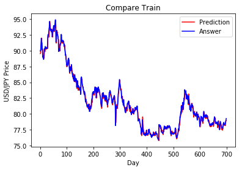
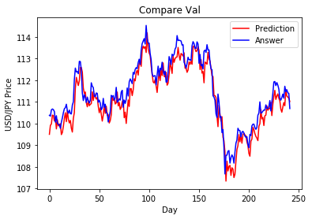

# . Kit Import


```python
import pandas as pd
import numpy as np
from keras.models import Sequential
from keras.layers import Dense, Dropout, Activation, Flatten, LSTM, TimeDistributed, RepeatVector
from keras.layers.normalization import BatchNormalization
from keras.optimizers import Adam
from keras.callbacks import EarlyStopping, ModelCheckpoint
from keras.losses import binary_crossentropy
from sklearn import preprocessing
import matplotlib.pyplot as plt
%matplotlib inline

import warnings
warnings.filterwarnings('ignore')
```

    D:\Program\Anaconda3\envs\tensorflow\lib\site-packages\h5py\__init__.py:34: FutureWarning: Conversion of the second argument of issubdtype from `float` to `np.floating` is deprecated. In future, it will be treated as `np.float64 == np.dtype(float).type`.
      from ._conv import register_converters as _register_converters
    Using TensorFlow backend.
    

# . Method definition block


```python
def readTrain(data):  # 讀取訓練資料
    train = pd.read_csv(data)
    train["Date"] = pd.to_datetime(train["Date"])
    train = train.sort_values(by="Date")
    train = train.reset_index(drop=True)
    return train

def augFeatures(train):   # 特徵擴展
#     train["year"] = train["Date"].dt.year
#     train["month"] = train["Date"].dt.month
    train["date"] = train["Date"].dt.day
    train["day"] = train["Date"].dt.dayofweek
    train["Change %"] = train["Change %"].apply(lambda x: float(x.replace("%","")))
    train["Label"] = train["Change %"].apply(lambda x: x>0 )
    train.rename(columns={'Price': 'Close'}, inplace=True)
    train = train.drop(["Date"], axis=1)
    
    ewma = pd.Series.ewm # 指數加權函數
    train['ewma_26'] =  train['Close'].transform(lambda x : ewma(x, span=26,ignore_na=False).mean())
    train['ewma_26'] = train['ewma_26'].fillna(0)  
    return train

def normalize(train):  # 資料歸一化 (使數值介於0~1之間)
    newdf= train.copy()
    min_max_scaler = preprocessing.MinMaxScaler()
    for col in train.columns:
         newdf[col] = min_max_scaler.fit_transform(train[col].values.reshape(-1,1)) 
    return newdf

def buildTrain(train, pastDay, futureDay,method,pred=False): # 訓練資料建立
    X_train, Y_train = [], []
    for i in range(train.shape[0]-futureDay-pastDay):
        X_train.append(np.array(train.iloc[i:i+pastDay]))
        if method == "Label":
            Y_train.append(np.array(train.iloc[i+pastDay:i+pastDay+futureDay]["Label"]))
        elif method == "reg":
            Y_train.append(np.array(train.iloc[i+pastDay:i+pastDay+futureDay]["Close"]))
    if not pred:
        return np.array(X_train), np.array(Y_train)
    else:
        return np.array(X_train)

def shuffle(X,Y): # 亂序
    np.random.seed(10)
    randomList = np.arange(X.shape[0])
    np.random.shuffle(randomList)
    return X[randomList], Y[randomList]

def splitData(X,Y,rate):  # 資料分割
    X_train = X[:int(X.shape[0]*rate)]
    Y_train = Y[:int(Y.shape[0]*rate)]
    X_val = X[int(X.shape[0]*(rate)):]
    Y_val = Y[int(Y.shape[0]*(rate)):]
    return X_train, Y_train, X_val, Y_val


def buildManyToOneModel(shape):
    model = Sequential()
    model.add(LSTM(10, input_length=shape[1], input_dim=shape[2]))
    # output shape: (1, 1)
    model.add(Dense(1))
    model.compile(loss="mse", optimizer="adam")
    model.summary()
    return model
```

# . Model establishment


```python
train = readTrain("USD_JPY Historical Data.csv")
train_Aug = augFeatures(train)
train_Aug.tail()
```


<div>
<style>
    .dataframe thead tr:only-child th {
        text-align: right;
    }

    .dataframe thead th {
        text-align: left;
    }

    .dataframe tbody tr th {
        vertical-align: top;
    }
</style>
<table border="1" class="dataframe">
  <thead>
    <tr style="text-align: right;">
      <th></th>
      <th>Close</th>
      <th>Open</th>
      <th>High</th>
      <th>Low</th>
      <th>Change %</th>
      <th>date</th>
      <th>day</th>
      <th>Label</th>
      <th>ewma_26</th>
    </tr>
  </thead>
  <tbody>
    <tr>
      <th>2442</th>
      <td>111.56</td>
      <td>111.50</td>
      <td>111.57</td>
      <td>111.44</td>
      <td>0.08</td>
      <td>17</td>
      <td>6</td>
      <td>True</td>
      <td>111.143107</td>
    </tr>
    <tr>
      <th>2443</th>
      <td>111.42</td>
      <td>111.45</td>
      <td>111.62</td>
      <td>111.28</td>
      <td>-0.12</td>
      <td>18</td>
      <td>0</td>
      <td>False</td>
      <td>111.163618</td>
    </tr>
    <tr>
      <th>2444</th>
      <td>111.39</td>
      <td>111.44</td>
      <td>111.48</td>
      <td>111.16</td>
      <td>-0.03</td>
      <td>19</td>
      <td>1</td>
      <td>False</td>
      <td>111.180387</td>
    </tr>
    <tr>
      <th>2445</th>
      <td>110.69</td>
      <td>111.41</td>
      <td>111.69</td>
      <td>110.53</td>
      <td>-0.63</td>
      <td>20</td>
      <td>2</td>
      <td>False</td>
      <td>111.144062</td>
    </tr>
    <tr>
      <th>2446</th>
      <td>110.81</td>
      <td>110.72</td>
      <td>110.97</td>
      <td>110.30</td>
      <td>0.11</td>
      <td>21</td>
      <td>3</td>
      <td>True</td>
      <td>111.119316</td>
    </tr>
  </tbody>
</table>
</div>


```python
train_norm = normalize(train_Aug)

# # build Data, use last 30 days to predict next 5 days
X_train, Y_train = buildTrain(train_norm,30,1,method="reg")
X_train, Y_train, X_val, Y_val = splitData(X_train, Y_train, 0.9) # regression / Classification

print("X_trian: %s\nY_train: %s\nX_val: %s\nY_val: %s"%(X_train.shape,Y_train.shape,X_val.shape,Y_val.shape))
# # from 2 dimmension to 3 dimension
# Y_train = Y_train[:,:,np.newaxis]
# Y_val = Y_val[:,:,np.newaxis]
# model = buildOneToOneModel(X_train.shape)
model = buildManyToOneModel(X_train.shape)
```

    X_trian: (2174, 30, 9)
    Y_train: (2174, 1)
    X_val: (242, 30, 9)
    Y_val: (242, 1)
    _________________________________________________________________
    Layer (type)                 Output Shape              Param #   
    =================================================================
    lstm_1 (LSTM)                (None, 10)                800       
    _________________________________________________________________
    dense_1 (Dense)              (None, 1)                 11        
    =================================================================
    Total params: 811
    Trainable params: 811
    Non-trainable params: 0
    _________________________________________________________________
    

# . Model training


```python
callback = EarlyStopping(monitor="loss", patience=10, verbose=1, mode="auto")
model.fit(X_train, Y_train, epochs=1000, batch_size=128, validation_data=(X_val, Y_val), callbacks=[callback])
```

    Train on 2174 samples, validate on 242 samples
    Epoch 1/1000
    2174/2174 [==============================] - 1s 372us/step - loss: 0.2178 - val_loss: 0.1201
    Epoch 2/1000
    2174/2174 [==============================] - 0s 121us/step - loss: 0.0355 - val_loss: 0.0080
    Epoch 3/1000
    2174/2174 [==============================] - 0s 120us/step - loss: 0.0152 - val_loss: 0.0015
    Epoch 4/1000
    2174/2174 [==============================] - 0s 120us/step - loss: 0.0102 - val_loss: 0.0026
    Epoch 5/1000
    2174/2174 [==============================] - 0s 122us/step - loss: 0.0076 - val_loss: 0.0021
    Epoch 6/1000
    2174/2174 [==============================] - 0s 137us/step - loss: 0.0066 - val_loss: 0.0013
    Epoch 7/1000
    2174/2174 [==============================] - 0s 125us/step - loss: 0.0057 - val_loss: 0.0013
    Epoch 8/1000
    2174/2174 [==============================] - 0s 124us/step - loss: 0.0049 - val_loss: 0.0012
    Epoch 9/1000
    2174/2174 [==============================] - 0s 123us/step - loss: 0.0043 - val_loss: 0.0011
    Epoch 10/1000
    2174/2174 [==============================] - 0s 119us/step - loss: 0.0037 - val_loss: 0.0010
    Epoch 11/1000
    2174/2174 [==============================] - 0s 119us/step - loss: 0.0032 - val_loss: 9.3227e-04
    Epoch 12/1000
    2174/2174 [==============================] - 0s 120us/step - loss: 0.0028 - val_loss: 8.7238e-04
    Epoch 13/1000
    2174/2174 [==============================] - 0s 121us/step - loss: 0.0024 - val_loss: 8.0942e-04
    Epoch 14/1000
    2174/2174 [==============================] - 0s 120us/step - loss: 0.0021 - val_loss: 7.5162e-04
    Epoch 15/1000
    2174/2174 [==============================] - 0s 120us/step - loss: 0.0018 - val_loss: 6.9075e-04
    Epoch 16/1000
    2174/2174 [==============================] - 0s 120us/step - loss: 0.0015 - val_loss: 6.2877e-04
    Epoch 17/1000
    2174/2174 [==============================] - 0s 121us/step - loss: 0.0013 - val_loss: 5.7477e-04
    Epoch 18/1000
    2174/2174 [==============================] - 0s 128us/step - loss: 0.0012 - val_loss: 5.2353e-04
    Epoch 19/1000
    2174/2174 [==============================] - 0s 124us/step - loss: 0.0010 - val_loss: 4.7276e-04
    Epoch 20/1000
    2174/2174 [==============================] - 0s 143us/step - loss: 9.0774e-04 - val_loss: 4.3711e-04
    Epoch 21/1000
    2174/2174 [==============================] - 0s 136us/step - loss: 8.0598e-04 - val_loss: 3.9493e-04
    Epoch 22/1000
    2174/2174 [==============================] - 0s 132us/step - loss: 7.2615e-04 - val_loss: 3.7066e-04
    Epoch 23/1000
    2174/2174 [==============================] - 0s 154us/step - loss: 6.5960e-04 - val_loss: 3.5080e-04
    Epoch 24/1000
    2174/2174 [==============================] - 0s 140us/step - loss: 6.0336e-04 - val_loss: 3.2744e-04
    Epoch 25/1000
    2174/2174 [==============================] - 0s 146us/step - loss: 5.5952e-04 - val_loss: 3.2941e-04
    Epoch 26/1000
    2174/2174 [==============================] - 0s 142us/step - loss: 5.2584e-04 - val_loss: 3.1057e-04
    Epoch 27/1000
    2174/2174 [==============================] - 0s 128us/step - loss: 4.9649e-04 - val_loss: 2.9748e-04
    Epoch 28/1000
    2174/2174 [==============================] - 0s 132us/step - loss: 4.7250e-04 - val_loss: 3.0113e-04
    Epoch 29/1000
    2174/2174 [==============================] - 0s 124us/step - loss: 4.5468e-04 - val_loss: 2.9152e-04
    Epoch 30/1000
    2174/2174 [==============================] - 0s 135us/step - loss: 4.3934e-04 - val_loss: 3.0103e-04
    Epoch 31/1000
    2174/2174 [==============================] - 0s 127us/step - loss: 4.2791e-04 - val_loss: 2.7487e-04
    Epoch 32/1000
    2174/2174 [==============================] - 0s 126us/step - loss: 4.1687e-04 - val_loss: 2.9511e-04
    Epoch 33/1000
    2174/2174 [==============================] - 0s 127us/step - loss: 4.0940e-04 - val_loss: 2.8402e-04
    Epoch 34/1000
    2174/2174 [==============================] - 0s 136us/step - loss: 4.0237e-04 - val_loss: 2.8027e-04
    Epoch 35/1000
    2174/2174 [==============================] - 0s 130us/step - loss: 3.9538e-04 - val_loss: 2.5841e-04
    Epoch 36/1000
    2174/2174 [==============================] - 0s 128us/step - loss: 3.8943e-04 - val_loss: 2.7217e-04
    Epoch 37/1000
    2174/2174 [==============================] - 0s 127us/step - loss: 3.8475e-04 - val_loss: 2.7902e-04
    Epoch 38/1000
    2174/2174 [==============================] - 0s 127us/step - loss: 3.8217e-04 - val_loss: 2.8056e-04
    Epoch 39/1000
    2174/2174 [==============================] - 0s 130us/step - loss: 3.7584e-04 - val_loss: 2.6440e-04
    Epoch 40/1000
    2174/2174 [==============================] - 0s 128us/step - loss: 3.7184e-04 - val_loss: 2.3984e-04
    Epoch 41/1000
    2174/2174 [==============================] - 0s 130us/step - loss: 3.6783e-04 - val_loss: 2.2917e-04
    Epoch 42/1000
    2174/2174 [==============================] - 0s 137us/step - loss: 3.6420e-04 - val_loss: 2.3026e-04
    Epoch 43/1000
    2174/2174 [==============================] - 0s 126us/step - loss: 3.6042e-04 - val_loss: 2.3995e-04
    Epoch 44/1000
    2174/2174 [==============================] - 0s 128us/step - loss: 3.5747e-04 - val_loss: 2.1021e-04
    Epoch 45/1000
    2174/2174 [==============================] - 0s 134us/step - loss: 3.5639e-04 - val_loss: 2.1034e-04
    Epoch 46/1000
    2174/2174 [==============================] - 0s 129us/step - loss: 3.5385e-04 - val_loss: 2.1933e-04
    Epoch 47/1000
    2174/2174 [==============================] - 0s 127us/step - loss: 3.4875e-04 - val_loss: 2.1136e-04
    Epoch 48/1000
    2174/2174 [==============================] - 0s 131us/step - loss: 3.4724e-04 - val_loss: 2.1145e-04
    Epoch 49/1000
    2174/2174 [==============================] - 0s 129us/step - loss: 3.4243e-04 - val_loss: 2.1181e-04
    Epoch 50/1000
    2174/2174 [==============================] - 0s 136us/step - loss: 3.4015e-04 - val_loss: 1.9591e-04
    Epoch 51/1000
    2174/2174 [==============================] - 0s 130us/step - loss: 3.3709e-04 - val_loss: 2.1174e-04
    Epoch 52/1000
    2174/2174 [==============================] - 0s 134us/step - loss: 3.3553e-04 - val_loss: 1.9758e-04
    Epoch 53/1000
    2174/2174 [==============================] - 0s 126us/step - loss: 3.3498e-04 - val_loss: 1.8352e-04
    Epoch 54/1000
    2174/2174 [==============================] - 0s 129us/step - loss: 3.3039e-04 - val_loss: 1.9030e-04
    Epoch 55/1000
    2174/2174 [==============================] - 0s 134us/step - loss: 3.2732e-04 - val_loss: 1.9370e-04
    Epoch 56/1000
    2174/2174 [==============================] - 0s 131us/step - loss: 3.2531e-04 - val_loss: 1.7750e-04
    Epoch 57/1000
    2174/2174 [==============================] - 0s 130us/step - loss: 3.2361e-04 - val_loss: 1.8391e-04
    Epoch 58/1000
    2174/2174 [==============================] - 0s 126us/step - loss: 3.2170e-04 - val_loss: 1.8384e-04
    Epoch 59/1000
    2174/2174 [==============================] - 0s 130us/step - loss: 3.1935e-04 - val_loss: 1.9290e-04
    Epoch 60/1000
    2174/2174 [==============================] - 0s 128us/step - loss: 3.1605e-04 - val_loss: 1.8638e-04
    Epoch 61/1000
    2174/2174 [==============================] - 0s 127us/step - loss: 3.1674e-04 - val_loss: 1.8917e-04
    Epoch 62/1000
    2174/2174 [==============================] - 0s 134us/step - loss: 3.1432e-04 - val_loss: 2.0236e-04
    Epoch 63/1000
    2174/2174 [==============================] - 0s 126us/step - loss: 3.0936e-04 - val_loss: 1.7344e-04
    Epoch 64/1000
    2174/2174 [==============================] - 0s 127us/step - loss: 3.0686e-04 - val_loss: 1.6208e-04
    Epoch 65/1000
    2174/2174 [==============================] - 0s 131us/step - loss: 3.0829e-04 - val_loss: 1.6710e-04
    Epoch 66/1000
    2174/2174 [==============================] - 0s 126us/step - loss: 3.0375e-04 - val_loss: 1.7373e-04
    Epoch 67/1000
    2174/2174 [==============================] - 0s 131us/step - loss: 3.0207e-04 - val_loss: 1.7581e-04
    Epoch 68/1000
    2174/2174 [==============================] - 0s 126us/step - loss: 2.9918e-04 - val_loss: 1.7672e-04
    Epoch 69/1000
    2174/2174 [==============================] - 0s 131us/step - loss: 2.9879e-04 - val_loss: 1.6331e-04
    Epoch 70/1000
    2174/2174 [==============================] - 0s 125us/step - loss: 2.9778e-04 - val_loss: 1.6193e-04
    Epoch 71/1000
    2174/2174 [==============================] - 0s 127us/step - loss: 2.9460e-04 - val_loss: 1.6731e-04
    Epoch 72/1000
    2174/2174 [==============================] - 0s 129us/step - loss: 2.9364e-04 - val_loss: 1.5513e-04
    Epoch 73/1000
    2174/2174 [==============================] - 0s 124us/step - loss: 2.9059e-04 - val_loss: 1.4915e-04
    Epoch 74/1000
    2174/2174 [==============================] - 0s 127us/step - loss: 2.9095e-04 - val_loss: 1.4977e-04
    Epoch 75/1000
    2174/2174 [==============================] - 0s 126us/step - loss: 2.8772e-04 - val_loss: 1.6072e-04
    Epoch 76/1000
    2174/2174 [==============================] - 0s 142us/step - loss: 2.8586e-04 - val_loss: 1.7054e-04
    Epoch 77/1000
    2174/2174 [==============================] - 0s 140us/step - loss: 2.8468e-04 - val_loss: 1.5160e-04
    Epoch 78/1000
    2174/2174 [==============================] - 0s 137us/step - loss: 2.8249e-04 - val_loss: 1.4387e-04
    Epoch 79/1000
    2174/2174 [==============================] - 0s 133us/step - loss: 2.8528e-04 - val_loss: 1.4554e-04
    Epoch 80/1000
    2174/2174 [==============================] - 0s 131us/step - loss: 2.7945e-04 - val_loss: 1.6049e-04
    Epoch 81/1000
    2174/2174 [==============================] - 0s 134us/step - loss: 2.7743e-04 - val_loss: 1.4970e-04
    Epoch 82/1000
    2174/2174 [==============================] - 0s 125us/step - loss: 2.7425e-04 - val_loss: 1.6713e-04
    Epoch 83/1000
    2174/2174 [==============================] - 0s 129us/step - loss: 2.7349e-04 - val_loss: 1.5612e-04
    Epoch 84/1000
    2174/2174 [==============================] - 0s 126us/step - loss: 2.7220e-04 - val_loss: 1.4738e-04
    Epoch 85/1000
    2174/2174 [==============================] - 0s 125us/step - loss: 2.7096e-04 - val_loss: 1.5364e-04
    Epoch 86/1000
    2174/2174 [==============================] - 0s 129us/step - loss: 2.6944e-04 - val_loss: 1.3933e-04
    Epoch 87/1000
    2174/2174 [==============================] - 0s 127us/step - loss: 2.6687e-04 - val_loss: 1.3588e-04
    Epoch 88/1000
    2174/2174 [==============================] - 0s 126us/step - loss: 2.6546e-04 - val_loss: 1.4948e-04
    Epoch 89/1000
    2174/2174 [==============================] - 0s 126us/step - loss: 2.6361e-04 - val_loss: 1.4574e-04
    Epoch 90/1000
    2174/2174 [==============================] - 0s 125us/step - loss: 2.6166e-04 - val_loss: 1.4921e-04
    Epoch 91/1000
    2174/2174 [==============================] - 0s 127us/step - loss: 2.6305e-04 - val_loss: 1.3486e-04
    Epoch 92/1000
    2174/2174 [==============================] - 0s 124us/step - loss: 2.5881e-04 - val_loss: 1.3009e-04
    Epoch 93/1000
    2174/2174 [==============================] - 0s 128us/step - loss: 2.5852e-04 - val_loss: 1.2946e-04
    Epoch 94/1000
    2174/2174 [==============================] - 0s 128us/step - loss: 2.5596e-04 - val_loss: 1.2837e-04
    Epoch 95/1000
    2174/2174 [==============================] - 0s 126us/step - loss: 2.5468e-04 - val_loss: 1.2992e-04
    Epoch 96/1000
    2174/2174 [==============================] - 0s 131us/step - loss: 2.5251e-04 - val_loss: 1.2577e-04
    Epoch 97/1000
    2174/2174 [==============================] - 0s 128us/step - loss: 2.5209e-04 - val_loss: 1.2679e-04
    Epoch 98/1000
    2174/2174 [==============================] - 0s 137us/step - loss: 2.5207e-04 - val_loss: 1.7954e-04
    Epoch 99/1000
    2174/2174 [==============================] - 0s 138us/step - loss: 2.5825e-04 - val_loss: 1.3951e-04
    Epoch 100/1000
    2174/2174 [==============================] - 0s 125us/step - loss: 2.5010e-04 - val_loss: 1.2138e-04
    Epoch 101/1000
    2174/2174 [==============================] - 0s 127us/step - loss: 2.4574e-04 - val_loss: 1.2709e-04
    Epoch 102/1000
    2174/2174 [==============================] - 0s 124us/step - loss: 2.4331e-04 - val_loss: 1.3096e-04
    Epoch 103/1000
    2174/2174 [==============================] - 0s 127us/step - loss: 2.4158e-04 - val_loss: 1.4344e-04
    Epoch 104/1000
    2174/2174 [==============================] - 0s 126us/step - loss: 2.4083e-04 - val_loss: 1.2141e-04
    Epoch 105/1000
    2174/2174 [==============================] - 0s 134us/step - loss: 2.3924e-04 - val_loss: 1.2753e-04
    Epoch 106/1000
    2174/2174 [==============================] - 0s 127us/step - loss: 2.3755e-04 - val_loss: 1.1912e-04
    Epoch 107/1000
    2174/2174 [==============================] - 0s 125us/step - loss: 2.3589e-04 - val_loss: 1.1714e-04
    Epoch 108/1000
    2174/2174 [==============================] - 0s 151us/step - loss: 2.3626e-04 - val_loss: 1.2076e-04
    Epoch 109/1000
    2174/2174 [==============================] - 0s 138us/step - loss: 2.3412e-04 - val_loss: 1.2544e-04
    Epoch 110/1000
    2174/2174 [==============================] - 0s 126us/step - loss: 2.3313e-04 - val_loss: 1.2552e-04
    Epoch 111/1000
    2174/2174 [==============================] - 0s 122us/step - loss: 2.3235e-04 - val_loss: 1.1412e-04
    Epoch 112/1000
    2174/2174 [==============================] - 0s 123us/step - loss: 2.3029e-04 - val_loss: 1.1693e-04
    Epoch 113/1000
    2174/2174 [==============================] - 0s 124us/step - loss: 2.2985e-04 - val_loss: 1.1054e-04
    Epoch 114/1000
    2174/2174 [==============================] - 0s 123us/step - loss: 2.2865e-04 - val_loss: 1.2736e-04
    Epoch 115/1000
    2174/2174 [==============================] - 0s 123us/step - loss: 2.2590e-04 - val_loss: 1.2095e-04
    Epoch 116/1000
    2174/2174 [==============================] - 0s 127us/step - loss: 2.2707e-04 - val_loss: 1.4753e-04
    Epoch 117/1000
    2174/2174 [==============================] - 0s 121us/step - loss: 2.2506e-04 - val_loss: 1.2675e-04
    Epoch 118/1000
    2174/2174 [==============================] - 0s 122us/step - loss: 2.2239e-04 - val_loss: 1.1020e-04
    Epoch 119/1000
    2174/2174 [==============================] - 0s 124us/step - loss: 2.2070e-04 - val_loss: 1.1201e-04
    Epoch 120/1000
    2174/2174 [==============================] - 0s 120us/step - loss: 2.2025e-04 - val_loss: 1.0684e-04
    Epoch 121/1000
    2174/2174 [==============================] - 0s 120us/step - loss: 2.1779e-04 - val_loss: 1.0371e-04
    Epoch 122/1000
    2174/2174 [==============================] - 0s 123us/step - loss: 2.1885e-04 - val_loss: 1.2599e-04
    Epoch 123/1000
    2174/2174 [==============================] - 0s 124us/step - loss: 2.1829e-04 - val_loss: 1.4744e-04
    Epoch 124/1000
    2174/2174 [==============================] - 0s 121us/step - loss: 2.1750e-04 - val_loss: 1.0406e-04
    Epoch 125/1000
    2174/2174 [==============================] - 0s 120us/step - loss: 2.1601e-04 - val_loss: 1.0532e-04
    Epoch 126/1000
    2174/2174 [==============================] - 0s 121us/step - loss: 2.1620e-04 - val_loss: 1.3002e-04
    Epoch 127/1000
    2174/2174 [==============================] - 0s 123us/step - loss: 2.1150e-04 - val_loss: 1.3158e-04
    Epoch 128/1000
    2174/2174 [==============================] - 0s 120us/step - loss: 2.1374e-04 - val_loss: 9.8017e-05
    Epoch 129/1000
    2174/2174 [==============================] - 0s 120us/step - loss: 2.1083e-04 - val_loss: 1.1085e-04
    Epoch 130/1000
    2174/2174 [==============================] - 0s 121us/step - loss: 2.0914e-04 - val_loss: 1.1101e-04
    Epoch 131/1000
    2174/2174 [==============================] - 0s 137us/step - loss: 2.0616e-04 - val_loss: 1.0426e-04
    Epoch 132/1000
    2174/2174 [==============================] - 0s 126us/step - loss: 2.0566e-04 - val_loss: 1.1356e-04
    Epoch 133/1000
    2174/2174 [==============================] - 0s 126us/step - loss: 2.0438e-04 - val_loss: 1.1925e-04
    Epoch 134/1000
    2174/2174 [==============================] - 0s 142us/step - loss: 2.0571e-04 - val_loss: 9.5047e-05
    Epoch 135/1000
    2174/2174 [==============================] - 0s 135us/step - loss: 2.0496e-04 - val_loss: 1.0849e-04
    Epoch 136/1000
    2174/2174 [==============================] - 0s 129us/step - loss: 2.0123e-04 - val_loss: 9.7122e-05
    Epoch 137/1000
    2174/2174 [==============================] - 0s 137us/step - loss: 2.0277e-04 - val_loss: 1.2447e-04
    Epoch 138/1000
    2174/2174 [==============================] - 0s 131us/step - loss: 2.0001e-04 - val_loss: 1.0494e-04
    Epoch 139/1000
    2174/2174 [==============================] - 0s 128us/step - loss: 1.9879e-04 - val_loss: 9.6387e-05
    Epoch 140/1000
    2174/2174 [==============================] - 0s 120us/step - loss: 1.9830e-04 - val_loss: 1.2153e-04
    Epoch 141/1000
    2174/2174 [==============================] - 0s 127us/step - loss: 1.9723e-04 - val_loss: 9.1917e-05
    Epoch 142/1000
    2174/2174 [==============================] - 0s 121us/step - loss: 1.9761e-04 - val_loss: 1.0126e-04
    Epoch 143/1000
    2174/2174 [==============================] - 0s 120us/step - loss: 1.9474e-04 - val_loss: 1.1585e-04
    Epoch 144/1000
    2174/2174 [==============================] - 0s 125us/step - loss: 1.9491e-04 - val_loss: 9.1251e-05
    Epoch 145/1000
    2174/2174 [==============================] - 0s 122us/step - loss: 1.9501e-04 - val_loss: 1.0212e-04
    Epoch 146/1000
    2174/2174 [==============================] - 0s 122us/step - loss: 1.9203e-04 - val_loss: 1.0518e-04
    Epoch 147/1000
    2174/2174 [==============================] - 0s 127us/step - loss: 1.9071e-04 - val_loss: 1.0853e-04
    Epoch 148/1000
    2174/2174 [==============================] - 0s 120us/step - loss: 1.9047e-04 - val_loss: 8.8076e-05
    Epoch 149/1000
    2174/2174 [==============================] - 0s 123us/step - loss: 1.9141e-04 - val_loss: 1.5189e-04
    Epoch 150/1000
    2174/2174 [==============================] - 0s 122us/step - loss: 1.9811e-04 - val_loss: 8.9480e-05
    Epoch 151/1000
    2174/2174 [==============================] - 0s 121us/step - loss: 1.8877e-04 - val_loss: 9.1803e-05
    Epoch 152/1000
    2174/2174 [==============================] - 0s 126us/step - loss: 1.8786e-04 - val_loss: 1.0580e-04
    Epoch 153/1000
    2174/2174 [==============================] - 0s 122us/step - loss: 1.8917e-04 - val_loss: 9.7149e-05
    Epoch 154/1000
    2174/2174 [==============================] - 0s 122us/step - loss: 1.8826e-04 - val_loss: 1.3071e-04
    Epoch 155/1000
    2174/2174 [==============================] - 0s 128us/step - loss: 1.8596e-04 - val_loss: 9.2193e-05
    Epoch 156/1000
    2174/2174 [==============================] - 0s 129us/step - loss: 1.8468e-04 - val_loss: 1.2308e-04
    Epoch 157/1000
    2174/2174 [==============================] - 0s 157us/step - loss: 1.8415e-04 - val_loss: 8.5343e-05
    Epoch 158/1000
    2174/2174 [==============================] - 0s 121us/step - loss: 1.8414e-04 - val_loss: 1.1443e-04
    Epoch 159/1000
    2174/2174 [==============================] - 0s 138us/step - loss: 1.8210e-04 - val_loss: 1.0532e-04
    Epoch 160/1000
    2174/2174 [==============================] - 0s 125us/step - loss: 1.8214e-04 - val_loss: 1.0063e-04
    Epoch 161/1000
    2174/2174 [==============================] - 0s 125us/step - loss: 1.8243e-04 - val_loss: 8.6697e-05
    Epoch 162/1000
    2174/2174 [==============================] - 0s 128us/step - loss: 1.7988e-04 - val_loss: 8.9944e-05
    Epoch 163/1000
    2174/2174 [==============================] - 0s 124us/step - loss: 1.8700e-04 - val_loss: 1.7042e-04
    Epoch 164/1000
    2174/2174 [==============================] - 0s 123us/step - loss: 1.8080e-04 - val_loss: 9.2781e-05
    Epoch 165/1000
    2174/2174 [==============================] - 0s 121us/step - loss: 1.7939e-04 - val_loss: 9.2302e-05
    Epoch 166/1000
    2174/2174 [==============================] - 0s 129us/step - loss: 1.7739e-04 - val_loss: 8.1465e-05
    Epoch 167/1000
    2174/2174 [==============================] - 0s 133us/step - loss: 1.8149e-04 - val_loss: 1.3365e-04
    Epoch 168/1000
    2174/2174 [==============================] - 0s 133us/step - loss: 1.7497e-04 - val_loss: 8.0267e-05
    Epoch 169/1000
    2174/2174 [==============================] - 0s 120us/step - loss: 1.7786e-04 - val_loss: 1.1208e-04
    Epoch 170/1000
    2174/2174 [==============================] - 0s 131us/step - loss: 1.7534e-04 - val_loss: 8.0621e-05
    Epoch 171/1000
    2174/2174 [==============================] - 0s 122us/step - loss: 1.7802e-04 - val_loss: 8.0286e-05
    Epoch 172/1000
    2174/2174 [==============================] - 0s 131us/step - loss: 1.7886e-04 - val_loss: 8.8879e-05
    Epoch 173/1000
    2174/2174 [==============================] - 0s 123us/step - loss: 1.7999e-04 - val_loss: 1.0746e-04
    Epoch 174/1000
    2174/2174 [==============================] - 0s 124us/step - loss: 1.7313e-04 - val_loss: 1.3241e-04
    Epoch 175/1000
    2174/2174 [==============================] - 0s 120us/step - loss: 1.7587e-04 - val_loss: 7.9119e-05
    Epoch 176/1000
    2174/2174 [==============================] - 0s 122us/step - loss: 1.7314e-04 - val_loss: 1.1979e-04
    Epoch 177/1000
    2174/2174 [==============================] - 0s 122us/step - loss: 1.7279e-04 - val_loss: 7.9080e-05
    Epoch 178/1000
    2174/2174 [==============================] - 0s 122us/step - loss: 1.7348e-04 - val_loss: 1.0858e-04
    Epoch 179/1000
    2174/2174 [==============================] - 0s 121us/step - loss: 1.7122e-04 - val_loss: 1.0829e-04
    Epoch 180/1000
    2174/2174 [==============================] - 0s 122us/step - loss: 1.7331e-04 - val_loss: 8.1344e-05
    Epoch 181/1000
    2174/2174 [==============================] - 0s 122us/step - loss: 1.8122e-04 - val_loss: 7.9756e-05
    Epoch 182/1000
    2174/2174 [==============================] - 0s 122us/step - loss: 1.8426e-04 - val_loss: 1.3969e-04
    Epoch 183/1000
    2174/2174 [==============================] - 0s 125us/step - loss: 1.6867e-04 - val_loss: 8.4483e-05
    Epoch 184/1000
    2174/2174 [==============================] - 0s 126us/step - loss: 1.6964e-04 - val_loss: 8.2446e-05
    Epoch 185/1000
    2174/2174 [==============================] - 0s 122us/step - loss: 1.7060e-04 - val_loss: 8.4132e-05
    Epoch 186/1000
    2174/2174 [==============================] - 0s 124us/step - loss: 1.6717e-04 - val_loss: 9.6251e-05
    Epoch 187/1000
    2174/2174 [==============================] - 0s 121us/step - loss: 1.6791e-04 - val_loss: 1.0460e-04
    Epoch 188/1000
    2174/2174 [==============================] - 0s 121us/step - loss: 1.6725e-04 - val_loss: 8.5237e-05
    Epoch 189/1000
    2174/2174 [==============================] - 0s 121us/step - loss: 1.6674e-04 - val_loss: 7.6337e-05
    Epoch 190/1000
    2174/2174 [==============================] - 0s 120us/step - loss: 1.6838e-04 - val_loss: 8.4805e-05
    Epoch 191/1000
    2174/2174 [==============================] - 0s 120us/step - loss: 1.6825e-04 - val_loss: 7.7209e-05
    Epoch 192/1000
    2174/2174 [==============================] - 0s 135us/step - loss: 1.6671e-04 - val_loss: 1.0814e-04
    Epoch 193/1000
    2174/2174 [==============================] - 0s 134us/step - loss: 1.6600e-04 - val_loss: 7.6510e-05
    Epoch 194/1000
    2174/2174 [==============================] - 0s 130us/step - loss: 1.6392e-04 - val_loss: 8.0821e-05
    Epoch 195/1000
    2174/2174 [==============================] - 0s 129us/step - loss: 1.6474e-04 - val_loss: 1.1012e-04
    Epoch 196/1000
    2174/2174 [==============================] - 0s 129us/step - loss: 1.6605e-04 - val_loss: 1.1199e-04
    Epoch 197/1000
    2174/2174 [==============================] - 0s 130us/step - loss: 1.6650e-04 - val_loss: 7.4746e-05
    Epoch 198/1000
    2174/2174 [==============================] - 0s 120us/step - loss: 1.6404e-04 - val_loss: 9.1654e-05
    Epoch 199/1000
    2174/2174 [==============================] - 0s 121us/step - loss: 1.6713e-04 - val_loss: 1.3055e-04
    Epoch 200/1000
    2174/2174 [==============================] - 0s 122us/step - loss: 1.6631e-04 - val_loss: 8.3414e-05
    Epoch 201/1000
    2174/2174 [==============================] - 0s 120us/step - loss: 1.6306e-04 - val_loss: 7.5955e-05
    Epoch 202/1000
    2174/2174 [==============================] - 0s 120us/step - loss: 1.6566e-04 - val_loss: 7.8185e-05
    Epoch 203/1000
    2174/2174 [==============================] - 0s 121us/step - loss: 1.6354e-04 - val_loss: 1.0658e-04
    Epoch 204/1000
    2174/2174 [==============================] - 0s 122us/step - loss: 1.6235e-04 - val_loss: 1.0012e-04
    Epoch 205/1000
    2174/2174 [==============================] - 0s 127us/step - loss: 1.6074e-04 - val_loss: 8.0136e-05
    Epoch 206/1000
    2174/2174 [==============================] - 0s 124us/step - loss: 1.6152e-04 - val_loss: 9.1018e-05
    Epoch 207/1000
    2174/2174 [==============================] - 0s 123us/step - loss: 1.6081e-04 - val_loss: 8.1483e-05
    Epoch 208/1000
    2174/2174 [==============================] - 0s 120us/step - loss: 1.5999e-04 - val_loss: 8.8758e-05
    Epoch 209/1000
    2174/2174 [==============================] - 0s 121us/step - loss: 1.5965e-04 - val_loss: 9.2109e-05
    Epoch 210/1000
    2174/2174 [==============================] - 0s 122us/step - loss: 1.6152e-04 - val_loss: 7.2806e-05
    Epoch 211/1000
    2174/2174 [==============================] - 0s 125us/step - loss: 1.6440e-04 - val_loss: 7.2560e-05
    Epoch 212/1000
    2174/2174 [==============================] - 0s 121us/step - loss: 1.6173e-04 - val_loss: 7.5210e-05
    Epoch 213/1000
    2174/2174 [==============================] - 0s 127us/step - loss: 1.6369e-04 - val_loss: 1.0510e-04
    Epoch 214/1000
    2174/2174 [==============================] - 0s 127us/step - loss: 1.5968e-04 - val_loss: 1.3303e-04
    Epoch 215/1000
    2174/2174 [==============================] - 0s 122us/step - loss: 1.6194e-04 - val_loss: 7.9606e-05
    Epoch 216/1000
    2174/2174 [==============================] - 0s 121us/step - loss: 1.6332e-04 - val_loss: 9.0733e-05
    Epoch 217/1000
    2174/2174 [==============================] - 0s 123us/step - loss: 1.5978e-04 - val_loss: 7.8143e-05
    Epoch 218/1000
    2174/2174 [==============================] - 0s 126us/step - loss: 1.6233e-04 - val_loss: 1.0642e-04
    Epoch 219/1000
    2174/2174 [==============================] - 0s 123us/step - loss: 1.6569e-04 - val_loss: 1.1395e-04
    Epoch 00219: early stopping
    


    <keras.callbacks.History at 0x1e7def63e80>


# . Model evaluation & forecasting


```python
from sklearn import preprocessing
def denormalize(df, norm_value):
    original_value = df['Close'].values.reshape(-1,1)
    norm_value = norm_value.reshape(-1,1)
    
    min_max_scaler = preprocessing.MinMaxScaler()
    min_max_scaler.fit_transform(original_value)
    denorm_value = min_max_scaler.inverse_transform(norm_value)   
    
    return denorm_value

# 顯示訓練成果(分數)
scores = model.evaluate(X_val, Y_val) 
print("Loss:{}".format(scores))

import matplotlib.pyplot as plt
%matplotlib inline  

pred = model.predict(X_train) #predict 2 ~ n-1
denorm_pred = denormalize(train_Aug, pred)
denorm_ytrain = denormalize(train_Aug, Y_train)
plt.plot(denorm_pred[:700],color='red', label='Prediction')
plt.plot(denorm_ytrain[:700],color='blue', label='Answer')
plt.legend(loc='best')
plt.title('Compare Train')
plt.xlabel('Day')
plt.ylabel('USD/JPY Price')
plt.show()

pred = model.predict(X_val)
denorm_pred = denormalize(train_Aug, pred)
denorm_ytest = denormalize(train_Aug, Y_val)
plt.plot(denorm_pred[:700],color='red', label='Prediction')
plt.plot(denorm_ytest[:700],color='blue', label='Answer')
plt.legend(loc='best')
plt.title('Compare Val')
plt.xlabel('Day')
plt.ylabel('USD/JPY Price')
plt.show()
```

    242/242 [==============================] - 0s 95us/step
    Loss:0.00011394615128755662
    








# . Data verification in the next 1 day


```python
future = readTrain("USD_JPY Historical Data One(Val).csv")
future_Aug = augFeatures(future)
future_Aug = future_Aug[:30] #3/1 ~ 4/4 (n=30)
future_Aug = future_Aug.reset_index(drop=True)
future_norm = normalize(future_Aug)
future_norm = future_norm.values.reshape(1,future_norm.shape[0],future_norm.shape[1])
future_pred = model.predict(future_norm) # predict future
denorm_pred = denormalize(future_Aug, future_pred) # 4/5
denorm_pred = denorm_pred[:,0][0]
print("4/5 Close :{}".format(denorm_pred))
future.tail()
```

    4/5 Close :111.38275146484375
    


<div>
<style>
    .dataframe thead tr:only-child th {
        text-align: right;
    }

    .dataframe thead th {
        text-align: left;
    }

    .dataframe tbody tr th {
        vertical-align: top;
    }
</style>
<table border="1" class="dataframe">
  <thead>
    <tr style="text-align: right;">
      <th></th>
      <th>Date</th>
      <th>Close</th>
      <th>Open</th>
      <th>High</th>
      <th>Low</th>
      <th>Change %</th>
      <th>date</th>
      <th>day</th>
      <th>Label</th>
    </tr>
  </thead>
  <tbody>
    <tr>
      <th>26</th>
      <td>2019-04-01</td>
      <td>111.36</td>
      <td>110.81</td>
      <td>111.45</td>
      <td>110.81</td>
      <td>0.34</td>
      <td>1</td>
      <td>0</td>
      <td>True</td>
    </tr>
    <tr>
      <th>27</th>
      <td>2019-04-02</td>
      <td>111.33</td>
      <td>111.34</td>
      <td>111.47</td>
      <td>111.25</td>
      <td>-0.03</td>
      <td>2</td>
      <td>1</td>
      <td>False</td>
    </tr>
    <tr>
      <th>28</th>
      <td>2019-04-03</td>
      <td>111.48</td>
      <td>111.33</td>
      <td>111.58</td>
      <td>111.20</td>
      <td>0.13</td>
      <td>3</td>
      <td>2</td>
      <td>True</td>
    </tr>
    <tr>
      <th>29</th>
      <td>2019-04-04</td>
      <td>111.67</td>
      <td>111.48</td>
      <td>111.69</td>
      <td>111.33</td>
      <td>0.17</td>
      <td>4</td>
      <td>3</td>
      <td>True</td>
    </tr>
    <tr>
      <th>30</th>
      <td>2019-04-05</td>
      <td>111.73</td>
      <td>111.64</td>
      <td>111.81</td>
      <td>111.58</td>
      <td>0.05</td>
      <td>5</td>
      <td>4</td>
      <td>True</td>
    </tr>
  </tbody>
</table>
</div>


