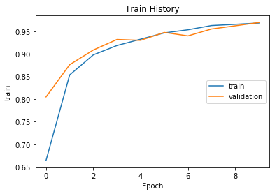
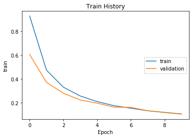

```python
import pandas as pd
import copy
from datetime import datetime
import matplotlib.pyplot as plt

from keras.models import Sequential
from keras.layers import Dense, Dropout, Activation, Flatten, LSTM, TimeDistributed, RepeatVector
from keras.layers.normalization import BatchNormalization
from keras.optimizers import Adam
from keras.callbacks import EarlyStopping, ModelCheckpoint
from keras.losses import binary_crossentropy
from keras.utils import np_utils  # 用來後續將 label 標籤轉為 one-hot-encoding

from sklearn.model_selection import train_test_split
from sklearn.preprocessing import StandardScaler
from sklearn.preprocessing import LabelEncoder
```

    D:\Program\Anaconda3\envs\tensorflow\lib\site-packages\h5py\__init__.py:34: FutureWarning: Conversion of the second argument of issubdtype from `float` to `np.floating` is deprecated. In future, it will be treated as `np.float64 == np.dtype(float).type`.
      from ._conv import register_converters as _register_converters
    Using TensorFlow backend.
    

# 1. Overview
 * Human Activity Recognition
 * Training 資料共有19622個
 * Testing資料共有406個
 * 我們發現資料中new_window為yes時，許多測試欄位有值
  => 我的做法是捨去過多缺失值的欄位
 * 預測目標classe共有5類分別為ABCDE
  => 我們將classe類別轉換為數字型label以便進行預測
 * 另外驗證資料有problem-id 這個欄位
  => 我們發現它只出現在這個資料中，所以也將該欄位移除


```python
#%% 1.	Overview
orig_train_df = pd.read_csv('pml-training.csv')
orig_train_df.head()
orig_train_df.describe()
print(orig_train_df.count())

orig_val_df = pd.read_csv('pml-testing.csv')
orig_val_df.head()
orig_val_df.describe()
print(orig_val_df.count())
#%%
[print(c) for c in orig_train_df.columns] # origin columns
[print(c) for c in orig_val_df.columns] # origin columns
```

    D:\Program\Anaconda3\envs\tensorflow\lib\site-packages\IPython\core\interactiveshell.py:2717: DtypeWarning: Columns (11,14,19,22,25,70,73,86,87,89,90,94,97,100) have mixed types. Specify dtype option on import or set low_memory=False.
      interactivity=interactivity, compiler=compiler, result=result)
    

    Unnamed: 0                 19622
    user_name                  19622
    raw_timestamp_part_1       19622
    raw_timestamp_part_2       19622
    cvtd_timestamp             19622
    new_window                 19622
    num_window                 19622
    roll_belt                  19622
    pitch_belt                 19622
    yaw_belt                   19622
    total_accel_belt           19622
    kurtosis_roll_belt           406
    kurtosis_picth_belt          406
    kurtosis_yaw_belt            406
    skewness_roll_belt           406
    skewness_roll_belt.1         406
    skewness_yaw_belt            406
    max_roll_belt                406
    max_picth_belt               406
    max_yaw_belt                 406
    min_roll_belt                406
    min_pitch_belt               406
    min_yaw_belt                 406
    amplitude_roll_belt          406
    amplitude_pitch_belt         406
    amplitude_yaw_belt           406
    var_total_accel_belt         406
    avg_roll_belt                406
    stddev_roll_belt             406
    var_roll_belt                406
                               ...  
    max_roll_forearm             406
    max_picth_forearm            406
    max_yaw_forearm              406
    min_roll_forearm             406
    min_pitch_forearm            406
    min_yaw_forearm              406
    amplitude_roll_forearm       406
    amplitude_pitch_forearm      406
    amplitude_yaw_forearm        406
    total_accel_forearm        19622
    var_accel_forearm            406
    avg_roll_forearm             406
    stddev_roll_forearm          406
    var_roll_forearm             406
    avg_pitch_forearm            406
    stddev_pitch_forearm         406
    var_pitch_forearm            406
    avg_yaw_forearm              406
    stddev_yaw_forearm           406
    var_yaw_forearm              406
    gyros_forearm_x            19622
    gyros_forearm_y            19622
    gyros_forearm_z            19622
    accel_forearm_x            19622
    accel_forearm_y            19622
    accel_forearm_z            19622
    magnet_forearm_x           19622
    magnet_forearm_y           19622
    magnet_forearm_z           19622
    classe                     19622
    Length: 160, dtype: int64
    Unnamed: 0                 20
    user_name                  20
    raw_timestamp_part_1       20
    raw_timestamp_part_2       20
    cvtd_timestamp             20
    new_window                 20
    num_window                 20
    roll_belt                  20
    pitch_belt                 20
    yaw_belt                   20
    total_accel_belt           20
    kurtosis_roll_belt          0
    kurtosis_picth_belt         0
    kurtosis_yaw_belt           0
    skewness_roll_belt          0
    skewness_roll_belt.1        0
    skewness_yaw_belt           0
    max_roll_belt               0
    max_picth_belt              0
    max_yaw_belt                0
    min_roll_belt               0
    min_pitch_belt              0
    min_yaw_belt                0
    amplitude_roll_belt         0
    amplitude_pitch_belt        0
    amplitude_yaw_belt          0
    var_total_accel_belt        0
    avg_roll_belt               0
    stddev_roll_belt            0
    var_roll_belt               0
                               ..
    max_roll_forearm            0
    max_picth_forearm           0
    max_yaw_forearm             0
    min_roll_forearm            0
    min_pitch_forearm           0
    min_yaw_forearm             0
    amplitude_roll_forearm      0
    amplitude_pitch_forearm     0
    amplitude_yaw_forearm       0
    total_accel_forearm        20
    var_accel_forearm           0
    avg_roll_forearm            0
    stddev_roll_forearm         0
    var_roll_forearm            0
    avg_pitch_forearm           0
    stddev_pitch_forearm        0
    var_pitch_forearm           0
    avg_yaw_forearm             0
    stddev_yaw_forearm          0
    var_yaw_forearm             0
    gyros_forearm_x            20
    gyros_forearm_y            20
    gyros_forearm_z            20
    accel_forearm_x            20
    accel_forearm_y            20
    accel_forearm_z            20
    magnet_forearm_x           20
    magnet_forearm_y           20
    magnet_forearm_z           20
    problem_id                 20
    Length: 160, dtype: int64
    Unnamed: 0
    user_name
    raw_timestamp_part_1
    raw_timestamp_part_2
    cvtd_timestamp
    new_window
    num_window
    roll_belt
    pitch_belt
    yaw_belt
    total_accel_belt
    kurtosis_roll_belt
    kurtosis_picth_belt
    kurtosis_yaw_belt
    skewness_roll_belt
    skewness_roll_belt.1
    skewness_yaw_belt
    max_roll_belt
    max_picth_belt
    max_yaw_belt
    min_roll_belt
    min_pitch_belt
    min_yaw_belt
    amplitude_roll_belt
    amplitude_pitch_belt
    amplitude_yaw_belt
    var_total_accel_belt
    avg_roll_belt
    stddev_roll_belt
    var_roll_belt
    avg_pitch_belt
    stddev_pitch_belt
    var_pitch_belt
    avg_yaw_belt
    stddev_yaw_belt
    var_yaw_belt
    gyros_belt_x
    gyros_belt_y
    gyros_belt_z
    accel_belt_x
    accel_belt_y
    accel_belt_z
    magnet_belt_x
    magnet_belt_y
    magnet_belt_z
    roll_arm
    pitch_arm
    yaw_arm
    total_accel_arm
    var_accel_arm
    avg_roll_arm
    stddev_roll_arm
    var_roll_arm
    avg_pitch_arm
    stddev_pitch_arm
    var_pitch_arm
    avg_yaw_arm
    stddev_yaw_arm
    var_yaw_arm
    gyros_arm_x
    gyros_arm_y
    gyros_arm_z
    accel_arm_x
    accel_arm_y
    accel_arm_z
    magnet_arm_x
    magnet_arm_y
    magnet_arm_z
    kurtosis_roll_arm
    kurtosis_picth_arm
    kurtosis_yaw_arm
    skewness_roll_arm
    skewness_pitch_arm
    skewness_yaw_arm
    max_roll_arm
    max_picth_arm
    max_yaw_arm
    min_roll_arm
    min_pitch_arm
    min_yaw_arm
    amplitude_roll_arm
    amplitude_pitch_arm
    amplitude_yaw_arm
    roll_dumbbell
    pitch_dumbbell
    yaw_dumbbell
    kurtosis_roll_dumbbell
    kurtosis_picth_dumbbell
    kurtosis_yaw_dumbbell
    skewness_roll_dumbbell
    skewness_pitch_dumbbell
    skewness_yaw_dumbbell
    max_roll_dumbbell
    max_picth_dumbbell
    max_yaw_dumbbell
    min_roll_dumbbell
    min_pitch_dumbbell
    min_yaw_dumbbell
    amplitude_roll_dumbbell
    amplitude_pitch_dumbbell
    amplitude_yaw_dumbbell
    total_accel_dumbbell
    var_accel_dumbbell
    avg_roll_dumbbell
    stddev_roll_dumbbell
    var_roll_dumbbell
    avg_pitch_dumbbell
    stddev_pitch_dumbbell
    var_pitch_dumbbell
    avg_yaw_dumbbell
    stddev_yaw_dumbbell
    var_yaw_dumbbell
    gyros_dumbbell_x
    gyros_dumbbell_y
    gyros_dumbbell_z
    accel_dumbbell_x
    accel_dumbbell_y
    accel_dumbbell_z
    magnet_dumbbell_x
    magnet_dumbbell_y
    magnet_dumbbell_z
    roll_forearm
    pitch_forearm
    yaw_forearm
    kurtosis_roll_forearm
    kurtosis_picth_forearm
    kurtosis_yaw_forearm
    skewness_roll_forearm
    skewness_pitch_forearm
    skewness_yaw_forearm
    max_roll_forearm
    max_picth_forearm
    max_yaw_forearm
    min_roll_forearm
    min_pitch_forearm
    min_yaw_forearm
    amplitude_roll_forearm
    amplitude_pitch_forearm
    amplitude_yaw_forearm
    total_accel_forearm
    var_accel_forearm
    avg_roll_forearm
    stddev_roll_forearm
    var_roll_forearm
    avg_pitch_forearm
    stddev_pitch_forearm
    var_pitch_forearm
    avg_yaw_forearm
    stddev_yaw_forearm
    var_yaw_forearm
    gyros_forearm_x
    gyros_forearm_y
    gyros_forearm_z
    accel_forearm_x
    accel_forearm_y
    accel_forearm_z
    magnet_forearm_x
    magnet_forearm_y
    magnet_forearm_z
    classe
    Unnamed: 0
    user_name
    raw_timestamp_part_1
    raw_timestamp_part_2
    cvtd_timestamp
    new_window
    num_window
    roll_belt
    pitch_belt
    yaw_belt
    total_accel_belt
    kurtosis_roll_belt
    kurtosis_picth_belt
    kurtosis_yaw_belt
    skewness_roll_belt
    skewness_roll_belt.1
    skewness_yaw_belt
    max_roll_belt
    max_picth_belt
    max_yaw_belt
    min_roll_belt
    min_pitch_belt
    min_yaw_belt
    amplitude_roll_belt
    amplitude_pitch_belt
    amplitude_yaw_belt
    var_total_accel_belt
    avg_roll_belt
    stddev_roll_belt
    var_roll_belt
    avg_pitch_belt
    stddev_pitch_belt
    var_pitch_belt
    avg_yaw_belt
    stddev_yaw_belt
    var_yaw_belt
    gyros_belt_x
    gyros_belt_y
    gyros_belt_z
    accel_belt_x
    accel_belt_y
    accel_belt_z
    magnet_belt_x
    magnet_belt_y
    magnet_belt_z
    roll_arm
    pitch_arm
    yaw_arm
    total_accel_arm
    var_accel_arm
    avg_roll_arm
    stddev_roll_arm
    var_roll_arm
    avg_pitch_arm
    stddev_pitch_arm
    var_pitch_arm
    avg_yaw_arm
    stddev_yaw_arm
    var_yaw_arm
    gyros_arm_x
    gyros_arm_y
    gyros_arm_z
    accel_arm_x
    accel_arm_y
    accel_arm_z
    magnet_arm_x
    magnet_arm_y
    magnet_arm_z
    kurtosis_roll_arm
    kurtosis_picth_arm
    kurtosis_yaw_arm
    skewness_roll_arm
    skewness_pitch_arm
    skewness_yaw_arm
    max_roll_arm
    max_picth_arm
    max_yaw_arm
    min_roll_arm
    min_pitch_arm
    min_yaw_arm
    amplitude_roll_arm
    amplitude_pitch_arm
    amplitude_yaw_arm
    roll_dumbbell
    pitch_dumbbell
    yaw_dumbbell
    kurtosis_roll_dumbbell
    kurtosis_picth_dumbbell
    kurtosis_yaw_dumbbell
    skewness_roll_dumbbell
    skewness_pitch_dumbbell
    skewness_yaw_dumbbell
    max_roll_dumbbell
    max_picth_dumbbell
    max_yaw_dumbbell
    min_roll_dumbbell
    min_pitch_dumbbell
    min_yaw_dumbbell
    amplitude_roll_dumbbell
    amplitude_pitch_dumbbell
    amplitude_yaw_dumbbell
    total_accel_dumbbell
    var_accel_dumbbell
    avg_roll_dumbbell
    stddev_roll_dumbbell
    var_roll_dumbbell
    avg_pitch_dumbbell
    stddev_pitch_dumbbell
    var_pitch_dumbbell
    avg_yaw_dumbbell
    stddev_yaw_dumbbell
    var_yaw_dumbbell
    gyros_dumbbell_x
    gyros_dumbbell_y
    gyros_dumbbell_z
    accel_dumbbell_x
    accel_dumbbell_y
    accel_dumbbell_z
    magnet_dumbbell_x
    magnet_dumbbell_y
    magnet_dumbbell_z
    roll_forearm
    pitch_forearm
    yaw_forearm
    kurtosis_roll_forearm
    kurtosis_picth_forearm
    kurtosis_yaw_forearm
    skewness_roll_forearm
    skewness_pitch_forearm
    skewness_yaw_forearm
    max_roll_forearm
    max_picth_forearm
    max_yaw_forearm
    min_roll_forearm
    min_pitch_forearm
    min_yaw_forearm
    amplitude_roll_forearm
    amplitude_pitch_forearm
    amplitude_yaw_forearm
    total_accel_forearm
    var_accel_forearm
    avg_roll_forearm
    stddev_roll_forearm
    var_roll_forearm
    avg_pitch_forearm
    stddev_pitch_forearm
    var_pitch_forearm
    avg_yaw_forearm
    stddev_yaw_forearm
    var_yaw_forearm
    gyros_forearm_x
    gyros_forearm_y
    gyros_forearm_z
    accel_forearm_x
    accel_forearm_y
    accel_forearm_z
    magnet_forearm_x
    magnet_forearm_y
    magnet_forearm_z
    problem_id
    


    [None,
     None,
     None,
     None,
     None,
     None,
     None,
     None,
     None,
     None,
     None,
     None,
     None,
     None,
     None,
     None,
     None,
     None,
     None,
     None,
     None,
     None,
     None,
     None,
     None,
     None,
     None,
     None,
     None,
     None,
     None,
     None,
     None,
     None,
     None,
     None,
     None,
     None,
     None,
     None,
     None,
     None,
     None,
     None,
     None,
     None,
     None,
     None,
     None,
     None,
     None,
     None,
     None,
     None,
     None,
     None,
     None,
     None,
     None,
     None,
     None,
     None,
     None,
     None,
     None,
     None,
     None,
     None,
     None,
     None,
     None,
     None,
     None,
     None,
     None,
     None,
     None,
     None,
     None,
     None,
     None,
     None,
     None,
     None,
     None,
     None,
     None,
     None,
     None,
     None,
     None,
     None,
     None,
     None,
     None,
     None,
     None,
     None,
     None,
     None,
     None,
     None,
     None,
     None,
     None,
     None,
     None,
     None,
     None,
     None,
     None,
     None,
     None,
     None,
     None,
     None,
     None,
     None,
     None,
     None,
     None,
     None,
     None,
     None,
     None,
     None,
     None,
     None,
     None,
     None,
     None,
     None,
     None,
     None,
     None,
     None,
     None,
     None,
     None,
     None,
     None,
     None,
     None,
     None,
     None,
     None,
     None,
     None,
     None,
     None,
     None,
     None,
     None,
     None,
     None,
     None,
     None,
     None,
     None,
     None]


# 2.	Background
 * Unnamed: 0 : index-->不重要
 * user_name : 使用者名字
 * raw_timestamp_part_1 : 時間戳記1
 * raw_timestamp_part_2 : 時間戳記2
 * cvtd_timestamp : 測試日期
 * new_window (yes/no) : 測試窗口 -->不重要
 * num_window  : 測試窗口數-->不重要
 * classe: 預測類別(Label) - training
 * problem_id: 錯誤代碼 - testing
 
### 皮帶測量值 (Belt)
 * 一般 : row、pitch、yaw、total
 * 陀螺儀 : gyros
 * 加速度 : accel
 * 強度 : magnet
 * 方向 : x,y,z
 
#### 細部測量值 (取決於 new_window)

 * 波峰 kurtosis
 * 偏移 skewness
 * 最大 max
 * 最小 min
 * 震幅 amplitude
 * 方差 var
 * 平均 avg
 * 標準差 stddev

 
 
 ### 手腕測量值 (Arm)
 * 陀螺儀 : gyros
 * 加速度 : accel
 * 強度 : magnet
 * 方向 : x,y,z
 
 ### 啞鈴測量值 (Dumbbell)
 * 一般 : row、pitch、yaw、total
 * 陀螺儀 : gyros
 * 加速度 : accel
 * 強度 : magnet
 * 方向 : x,y,z
 
  ### 前臂測量值 (forearm)
 * 一般 : row、pitch、yaw、total
 * 陀螺儀 : gyros
 * 加速度 : accel
 * 強度 : magnet
 * 方向 : x,y,z

# 3 .Data Exploration
 ## 步驟如下
 #### 1 . 將資料裡的缺失值統一以0為填充
 #### 2 . 將數量超過一半以上的缺失欄位丟棄
 #### 3 . 丟棄以下欄位
  * ##### 'Unnamed: 0'
  * ##### 'new_window'
  * ##### 'num_window'
  * ##### 'problem_id' 

#### 4 . 進行特徵擴充
  * ##### 將時間戳記日期格式進行處理 => 取得時間差
  * ##### 將目標預測類別欄位以LabelEncoder進行編碼


```python
def Clean(df):
    df = df.fillna(0)
    # 挑選DROP欄位
    dropCol = []
    # key = '#DIV/0!'
    key = 0
    for col in df.columns:
        count = list(df[col]).count(key)
        if count > df[col].count() / 2:
            dropCol.append(col)
        # print("Column:{} , Containin {} 個{}".format(col,count,key))
    # print("Column Drop:{}".format(dropCol))
    # print()
    for col in dropCol:
        df = df.drop(col,axis=1)  
    
    dropCol=['Unnamed: 0','new_window','num_window','problem_id']
    for col in dropCol:
        if col in df.columns:
            df = df.drop(col,axis=1)  

    return df

def Argu(df):
    def ts(row):
        return str(row['raw_timestamp_part_1'])+ "."+ str(row['raw_timestamp_part_2'])
    df["cvtd_timestamp"] = pd.to_datetime(df["cvtd_timestamp"])
    df["raw_timestamp"] = df.apply(ts,axis=1)
    df["raw_timestamp"] = pd.to_datetime(df["raw_timestamp"], unit='s').dt.strftime('%Y-%m-%d %H:%M:%S')
    df["raw_timestamp"] = pd.to_datetime(df["raw_timestamp"])
    df = df.drop('raw_timestamp_part_1',axis=1)  
    df = df.drop('raw_timestamp_part_2',axis=1)     
    
    def sub_dateTime(row):
        sub = (row['raw_timestamp'] - row['cvtd_timestamp']).days
        return sub

    df['Interval'] = df.apply(sub_dateTime,axis=1)
    # df[''] = df['data1'].groupby(df['key1'])
    df = df.sort_values(by=['user_name','cvtd_timestamp','raw_timestamp'])     
    df = df.reset_index(drop=True)
    df = df.drop('cvtd_timestamp',axis=1)  
    df = df.drop('raw_timestamp',axis=1)  
    df = df.drop('user_name',axis=1) 

    if 'classe' in df.columns:
        # df['classe'] = df['classe'].map(cat_mapping)
        global class_le
        class_le = LabelEncoder()
        df['classe'] = class_le.fit_transform(df['classe'].values)

    # if 'classe' in df.columns:
    #     np_utils.to_categorical(df['classe'], num_classes=5)

    return df

train_df = pd.read_csv('pml-training.csv')
train_df = Clean(train_df)
train_df = Argu(train_df)

val_df = pd.read_csv('pml-testing.csv')
val_df = Clean(val_df)
val_df = Argu(val_df)

train_df.head()
# [c for c in train_df.columns] # remain columns
# [c for c in val_df.columns] # remain columns
```

    D:\Program\Anaconda3\envs\tensorflow\lib\site-packages\IPython\core\interactiveshell.py:2717: DtypeWarning: Columns (11,14,19,22,25,70,73,86,87,89,90,94,97,100) have mixed types. Specify dtype option on import or set low_memory=False.
      interactivity=interactivity, compiler=compiler, result=result)
    


<div>
<style>
    .dataframe thead tr:only-child th {
        text-align: right;
    }

    .dataframe thead th {
        text-align: left;
    }

    .dataframe tbody tr th {
        vertical-align: top;
    }
</style>
<table border="1" class="dataframe">
  <thead>
    <tr style="text-align: right;">
      <th></th>
      <th>roll_belt</th>
      <th>pitch_belt</th>
      <th>yaw_belt</th>
      <th>total_accel_belt</th>
      <th>gyros_belt_x</th>
      <th>gyros_belt_y</th>
      <th>gyros_belt_z</th>
      <th>accel_belt_x</th>
      <th>accel_belt_y</th>
      <th>accel_belt_z</th>
      <th>...</th>
      <th>gyros_forearm_y</th>
      <th>gyros_forearm_z</th>
      <th>accel_forearm_x</th>
      <th>accel_forearm_y</th>
      <th>accel_forearm_z</th>
      <th>magnet_forearm_x</th>
      <th>magnet_forearm_y</th>
      <th>magnet_forearm_z</th>
      <th>classe</th>
      <th>Interval</th>
    </tr>
  </thead>
  <tbody>
    <tr>
      <th>0</th>
      <td>122.0</td>
      <td>-44.1</td>
      <td>179.0</td>
      <td>18</td>
      <td>0.18</td>
      <td>0.1</td>
      <td>-0.15</td>
      <td>45</td>
      <td>43</td>
      <td>-160</td>
      <td>...</td>
      <td>-0.75</td>
      <td>1.95</td>
      <td>32</td>
      <td>112</td>
      <td>-5</td>
      <td>564</td>
      <td>-377.0</td>
      <td>157.0</td>
      <td>0</td>
      <td>293</td>
    </tr>
    <tr>
      <th>1</th>
      <td>122.0</td>
      <td>-44.2</td>
      <td>179.0</td>
      <td>18</td>
      <td>0.19</td>
      <td>0.1</td>
      <td>-0.15</td>
      <td>45</td>
      <td>43</td>
      <td>-161</td>
      <td>...</td>
      <td>-1.65</td>
      <td>2.08</td>
      <td>46</td>
      <td>104</td>
      <td>7</td>
      <td>600</td>
      <td>-340.0</td>
      <td>120.0</td>
      <td>0</td>
      <td>293</td>
    </tr>
    <tr>
      <th>2</th>
      <td>122.0</td>
      <td>-44.2</td>
      <td>179.0</td>
      <td>18</td>
      <td>0.18</td>
      <td>0.1</td>
      <td>-0.13</td>
      <td>47</td>
      <td>44</td>
      <td>-160</td>
      <td>...</td>
      <td>-2.30</td>
      <td>1.79</td>
      <td>71</td>
      <td>95</td>
      <td>22</td>
      <td>617</td>
      <td>-319.0</td>
      <td>82.0</td>
      <td>0</td>
      <td>293</td>
    </tr>
    <tr>
      <th>3</th>
      <td>122.0</td>
      <td>-44.2</td>
      <td>179.0</td>
      <td>18</td>
      <td>0.16</td>
      <td>0.1</td>
      <td>-0.13</td>
      <td>44</td>
      <td>48</td>
      <td>-163</td>
      <td>...</td>
      <td>-2.44</td>
      <td>1.38</td>
      <td>106</td>
      <td>82</td>
      <td>45</td>
      <td>646</td>
      <td>-258.0</td>
      <td>16.0</td>
      <td>0</td>
      <td>293</td>
    </tr>
    <tr>
      <th>4</th>
      <td>122.0</td>
      <td>-44.2</td>
      <td>179.0</td>
      <td>18</td>
      <td>0.18</td>
      <td>0.1</td>
      <td>-0.15</td>
      <td>36</td>
      <td>46</td>
      <td>-162</td>
      <td>...</td>
      <td>-1.89</td>
      <td>0.87</td>
      <td>140</td>
      <td>71</td>
      <td>61</td>
      <td>639</td>
      <td>-221.0</td>
      <td>-18.0</td>
      <td>0</td>
      <td>293</td>
    </tr>
  </tbody>
</table>
<p>5 rows × 54 columns</p>
</div>


# 4.	Prediction Modeling
 ## 步驟如下
 #### 1 . 將需要作預測的特徵欄位分離出來 => feaCols
 #### 2 . 將訓練資料集的資料，以test_size為0.2的比例分割為X_train,X_test,y_train,y_test
 #### 3 . 將feature進行Normalize => 這裡用的是StandardScaler
 #### 4 . 將Label進行OneHotEncode => 這裡用的是np_utils.to_categorical
 #### 5 . 進行建模(1-h DNN)
  * ##### Input_Layer : Size = 53
  * ##### Hidden_Layer : Size = 256 ，activation='relu'
  * ##### Output_Layer : Size = 5 (predict_classes) ，activation='softmax'
  * ##### 採用categorical_crossentropy作為預測分類的Loss Function
  * ##### 採用Adam作為模型優化器
  * ##### 採用accuracy衡量準確率

#### 6 . 進行模型訓練
  * ##### 驗證集比例為0.2, 10個epochs, batch_size為32,
#### 7 . 進行模型評估
  * #####  損失約為0.11 準確率為0.966
#### 8 . 描繪模型準確率
#### 9 . 描繪模型誤差率


```python
feaCols = [col  for col in train_df.columns if col!="classe"]
print(feaCols)

X_train,X_test,y_train,y_test = train_test_split(
    train_df[feaCols],
    train_df["classe"],
    test_size = 0.2,
    random_state = 0
)

sc = StandardScaler()
sc.fit(X_train)
X_train_Std = sc.transform(X_train)
X_test_Std = sc.transform(X_test)

y_TrainOneHot = np_utils.to_categorical(y_train,num_classes=5)
y_TestOneHot  = np_utils.to_categorical(y_test,num_classes=5)

#%%

def buildModel(shape):
    model = Sequential()
    # Add Input layer, 隱藏層(hidden layer) 有 256個輸出變數
    model.add(Dense(units=256, input_dim=shape[1], kernel_initializer='normal', activation='relu')) 
    # Add output layer
    model.add(Dense(units=5, kernel_initializer='normal', activation='softmax'))
    # 編譯: 選擇損失函數、優化方法及成效衡量方式
    model.compile(loss='categorical_crossentropy', optimizer='adam', metrics=['accuracy']) 

    return model

print(X_train_Std.shape)
model = buildModel(X_train_Std.shape)
# # 進行訓練, 訓練過程會存在 train_history 變數中
train_history = model.fit(x=X_train_Std, y=y_TrainOneHot, validation_split=0.2, epochs=10, batch_size=32, verbose=2)  

# # 顯示訓練成果(分數)
scores = model.evaluate(X_test_Std, y_TestOneHot)  
print('Loss :{} , Accuracy:{} '.format(scores[0],scores[1]))
```

    ['roll_belt', 'pitch_belt', 'yaw_belt', 'total_accel_belt', 'gyros_belt_x', 'gyros_belt_y', 'gyros_belt_z', 'accel_belt_x', 'accel_belt_y', 'accel_belt_z', 'magnet_belt_x', 'magnet_belt_y', 'magnet_belt_z', 'roll_arm', 'pitch_arm', 'yaw_arm', 'total_accel_arm', 'gyros_arm_x', 'gyros_arm_y', 'gyros_arm_z', 'accel_arm_x', 'accel_arm_y', 'accel_arm_z', 'magnet_arm_x', 'magnet_arm_y', 'magnet_arm_z', 'roll_dumbbell', 'pitch_dumbbell', 'yaw_dumbbell', 'total_accel_dumbbell', 'gyros_dumbbell_x', 'gyros_dumbbell_y', 'gyros_dumbbell_z', 'accel_dumbbell_x', 'accel_dumbbell_y', 'accel_dumbbell_z', 'magnet_dumbbell_x', 'magnet_dumbbell_y', 'magnet_dumbbell_z', 'roll_forearm', 'pitch_forearm', 'yaw_forearm', 'total_accel_forearm', 'gyros_forearm_x', 'gyros_forearm_y', 'gyros_forearm_z', 'accel_forearm_x', 'accel_forearm_y', 'accel_forearm_z', 'magnet_forearm_x', 'magnet_forearm_y', 'magnet_forearm_z', 'Interval']
    (15697, 53)
    Train on 12557 samples, validate on 3140 samples
    Epoch 1/10
     - 1s - loss: 0.9307 - acc: 0.6642 - val_loss: 0.6059 - val_acc: 0.8048
    Epoch 2/10
     - 1s - loss: 0.4740 - acc: 0.8535 - val_loss: 0.3711 - val_acc: 0.8761
    Epoch 3/10
     - 0s - loss: 0.3307 - acc: 0.8979 - val_loss: 0.2795 - val_acc: 0.9086
    Epoch 4/10
     - 1s - loss: 0.2562 - acc: 0.9185 - val_loss: 0.2224 - val_acc: 0.9318
    Epoch 5/10
     - 1s - loss: 0.2094 - acc: 0.9325 - val_loss: 0.1962 - val_acc: 0.9299
    Epoch 6/10
     - 0s - loss: 0.1748 - acc: 0.9464 - val_loss: 0.1623 - val_acc: 0.9475
    Epoch 7/10
     - 0s - loss: 0.1535 - acc: 0.9533 - val_loss: 0.1602 - val_acc: 0.9398
    Epoch 8/10
     - 0s - loss: 0.1316 - acc: 0.9627 - val_loss: 0.1320 - val_acc: 0.9551
    Epoch 9/10
     - 1s - loss: 0.1182 - acc: 0.9654 - val_loss: 0.1169 - val_acc: 0.9621
    Epoch 10/10
     - 1s - loss: 0.1051 - acc: 0.9683 - val_loss: 0.1033 - val_acc: 0.9694
    3925/3925 [==============================] - 0s 17us/step
    Loss :0.10463744896042879 , Accuracy:0.9719745222929936 
    


```python
def show_train_history(train_history, train, validation):
    plt.plot(train_history.history[train])
    plt.plot(train_history.history[validation])
    plt.title('Train History')
    plt.ylabel('train')
    plt.xlabel('Epoch')
    plt.legend(['train', 'validation'], loc='center right')
    plt.show()
show_train_history(train_history, 'acc','val_acc')
```





```python
show_train_history(train_history, 'loss','val_loss')
```





# 5.	Model Application
 * 以相同方式擷取驗證資料特徵
 * 將原本LabelEncoder數值化的預測類別進行反映設
 * 並將結果附加在驗證資料集的classe欄位


```python
#%% 5.	Model Application
sc = StandardScaler()
sc.fit(val_df)
X_val_Std = sc.transform(val_df)

val_df['classe'] = model.predict_classes(X_val_Std)
orig_val_df['classe'] = class_le.inverse_transform(val_df['classe'].values)
#%%
orig_val_df.head()
```

    D:\Program\Anaconda3\envs\tensorflow\lib\site-packages\sklearn\preprocessing\label.py:171: DeprecationWarning: The truth value of an empty array is ambiguous. Returning False, but in future this will result in an error. Use `array.size > 0` to check that an array is not empty.
      if diff:
    


<div>
<style>
    .dataframe thead tr:only-child th {
        text-align: right;
    }

    .dataframe thead th {
        text-align: left;
    }

    .dataframe tbody tr th {
        vertical-align: top;
    }
</style>
<table border="1" class="dataframe">
  <thead>
    <tr style="text-align: right;">
      <th></th>
      <th>Unnamed: 0</th>
      <th>user_name</th>
      <th>raw_timestamp_part_1</th>
      <th>raw_timestamp_part_2</th>
      <th>cvtd_timestamp</th>
      <th>new_window</th>
      <th>num_window</th>
      <th>roll_belt</th>
      <th>pitch_belt</th>
      <th>yaw_belt</th>
      <th>...</th>
      <th>gyros_forearm_y</th>
      <th>gyros_forearm_z</th>
      <th>accel_forearm_x</th>
      <th>accel_forearm_y</th>
      <th>accel_forearm_z</th>
      <th>magnet_forearm_x</th>
      <th>magnet_forearm_y</th>
      <th>magnet_forearm_z</th>
      <th>problem_id</th>
      <th>classe</th>
    </tr>
  </thead>
  <tbody>
    <tr>
      <th>0</th>
      <td>1</td>
      <td>pedro</td>
      <td>1323095002</td>
      <td>868349</td>
      <td>05/12/2011 14:23</td>
      <td>no</td>
      <td>74</td>
      <td>123.00</td>
      <td>27.00</td>
      <td>-4.75</td>
      <td>...</td>
      <td>-3.34</td>
      <td>-0.59</td>
      <td>-110</td>
      <td>267</td>
      <td>-149</td>
      <td>-714</td>
      <td>419</td>
      <td>617</td>
      <td>1</td>
      <td>A</td>
    </tr>
    <tr>
      <th>1</th>
      <td>2</td>
      <td>jeremy</td>
      <td>1322673067</td>
      <td>778725</td>
      <td>30/11/2011 17:11</td>
      <td>no</td>
      <td>431</td>
      <td>1.02</td>
      <td>4.87</td>
      <td>-88.90</td>
      <td>...</td>
      <td>-2.78</td>
      <td>-0.18</td>
      <td>212</td>
      <td>297</td>
      <td>-118</td>
      <td>-237</td>
      <td>791</td>
      <td>873</td>
      <td>2</td>
      <td>A</td>
    </tr>
    <tr>
      <th>2</th>
      <td>3</td>
      <td>jeremy</td>
      <td>1322673075</td>
      <td>342967</td>
      <td>30/11/2011 17:11</td>
      <td>no</td>
      <td>439</td>
      <td>0.87</td>
      <td>1.82</td>
      <td>-88.50</td>
      <td>...</td>
      <td>-0.79</td>
      <td>0.28</td>
      <td>154</td>
      <td>271</td>
      <td>-129</td>
      <td>-51</td>
      <td>698</td>
      <td>783</td>
      <td>3</td>
      <td>B</td>
    </tr>
    <tr>
      <th>3</th>
      <td>4</td>
      <td>adelmo</td>
      <td>1322832789</td>
      <td>560311</td>
      <td>02/12/2011 13:33</td>
      <td>no</td>
      <td>194</td>
      <td>125.00</td>
      <td>-41.60</td>
      <td>162.00</td>
      <td>...</td>
      <td>0.69</td>
      <td>1.80</td>
      <td>-92</td>
      <td>406</td>
      <td>-39</td>
      <td>-233</td>
      <td>783</td>
      <td>521</td>
      <td>4</td>
      <td>B</td>
    </tr>
    <tr>
      <th>4</th>
      <td>5</td>
      <td>eurico</td>
      <td>1322489635</td>
      <td>814776</td>
      <td>28/11/2011 14:13</td>
      <td>no</td>
      <td>235</td>
      <td>1.35</td>
      <td>3.33</td>
      <td>-88.60</td>
      <td>...</td>
      <td>3.10</td>
      <td>0.80</td>
      <td>131</td>
      <td>-93</td>
      <td>172</td>
      <td>375</td>
      <td>-787</td>
      <td>91</td>
      <td>5</td>
      <td>E</td>
    </tr>
  </tbody>
</table>
<p>5 rows × 161 columns</p>
</div>


```python

```
